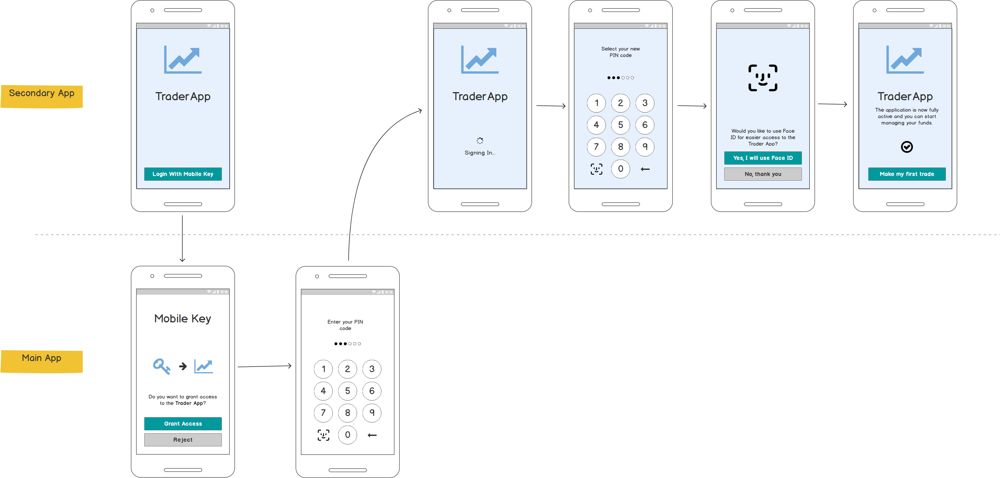

# Introducing the Activation Spawn
<!-- AUTHOR joshis_tweets 2021-09-17T00:00:00Z -->
<!-- SIDEBAR _Sidebar.md sticky -->
<!-- TEMPLATE tutorial -->
<!-- COVER_IMAGE activation-spawn-cover.jpg -->

It is common for organizations to have more than one mobile apps. Usually, though, one mobile app is considered the "main application," while the other apps are "secondary." For example, a bank can have a mobile banking app, mobile brokerage app, mortgage management app, etc. With multiple apps in place, many of the use-cases organizations must solve become complicated. For example, if a user loses the smartphone, they need to recover multiple apps.

To make the activation process of secondary apps easier and to allow faster user onboarding to new innovative products, we are introducing the activation spawn.

The purpose of the activation spawn is to create a new activation for a secondary app using the main app. From the customer perspective, this can be communicated, for example, through a message: "Activate mobile trading app using our mobile banking app."

## User's Perspective

The following mockup shows the user experience of the Activation Spawn process:

## Activation Spawn Actors

The process has two actors:

- **Main app** - The app used for activation of other apps. The app fetches the activation code from a secure endpoint (providing activation OTP in request) and passes the encrypted value (protected using a materialized white-box crypto key) via the URL scheme to the secondary app.
- **Secondary app** - The app that needs to be activated. It receives the encrypted activation code and activation OTP via the URL scheme and uses this to launch a regular app activation.

## Continue Reading

- [Activaton Spawn on iOS](Activation-Spawn-on-iOS.md#)
- [Activaton Spawn on Android](Activation-Spawn-on-Android.md#)

## Reference

- [Activation Spawn API Reference](Activation-Spawn-API-Reference.md)
