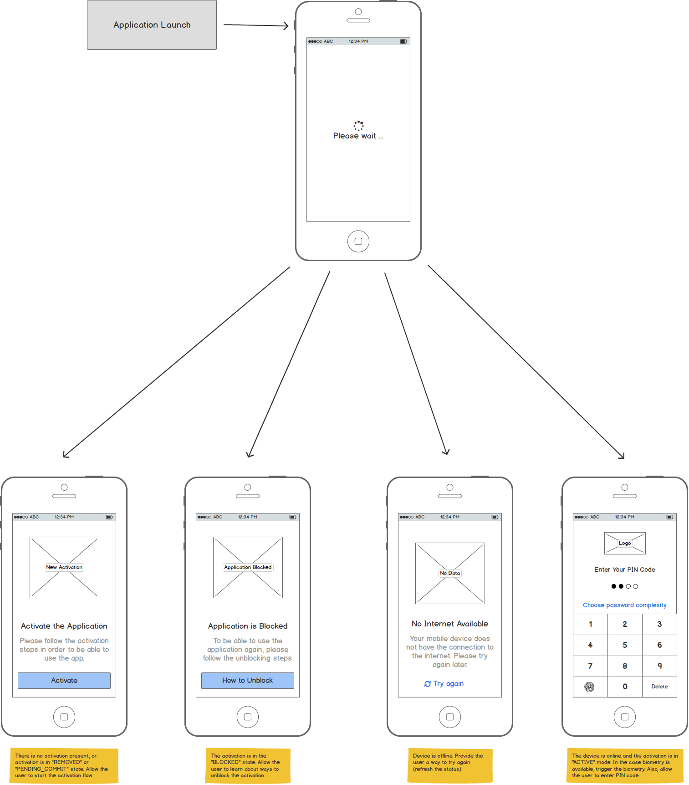
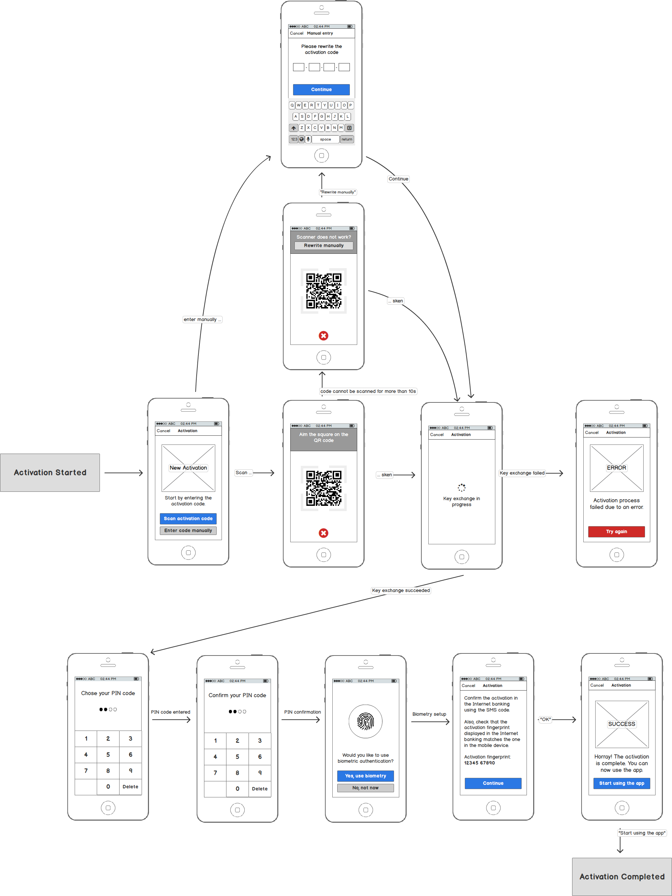
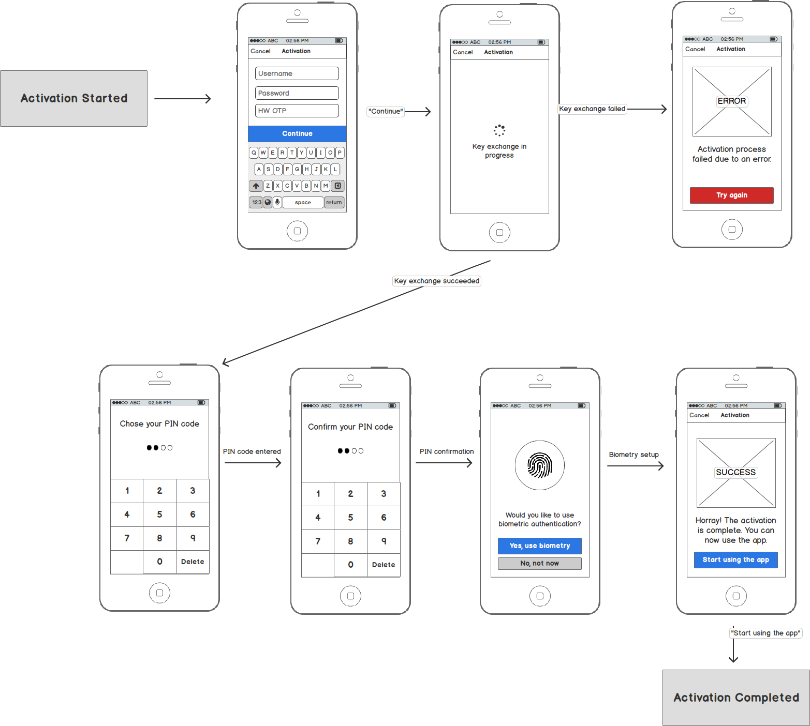
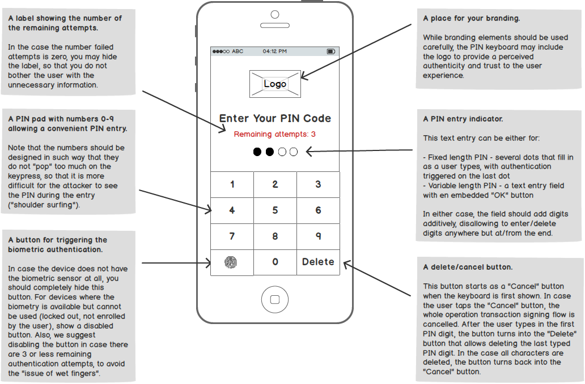
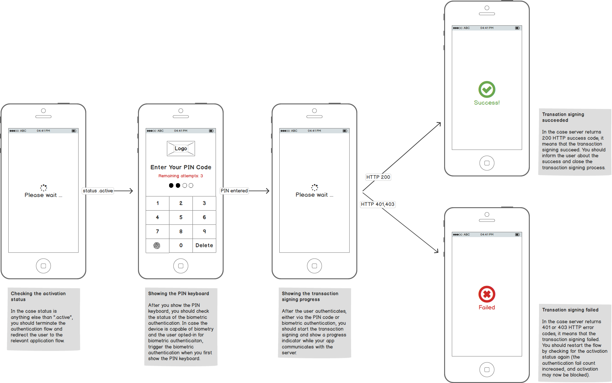

# Implementing Authentication in Mobile Banking Apps (SCA) on Android Platform

<!-- AUTHOR joshis_tweets 2020-05-04T00:00:00Z -->

In this tutorial, we will show you how to implement authentication into your mobile banking or fintech app on Android. This tutorial has four parts:

- [Mobile Authentication Overview](Readme.md)
- [Tutorial for Server Side Developers](Server-Side-Tutorial.md)
- [Tutorial for iOS Developers](iOS-Tutorial.md)
- **Tutorial for Android Developers**

## Prerequisites

This tutorial assumes, that you have:

- Read and understood the [Mobile Authentication Overview](Readme.md)
- [Required back-end infrastructure up and running](Server-Side-Tutorial.md).
- Android Studio and Android SDK (API level 16+).

## Introduction

When implementing the authentication flow on mobile, your task consists of building two major use-cases outlined in the [introductory overview documentation](Readme.md):

- Device activation
- Transaction signing

Of course, you will need to also implement several auxiliary use-cases but these will become simple once you have device activation and transaction signing use-cases in place.

Our [Mobile Security Suite SDK](https://wultra.com/mobile-security-suite) will help you with the above-mentioned use-cases. Since the underlying authentication protocol is called PowerAuth, the Mobile Security Suite SDK technical components inherit this naming. The "Mobile Security Suite SDK" is called the **PowerAuth SDK** on the technical level.

During the device activation flow, the SDK communicates with the public enrollment services. During the transaction signing, the SDK communicates with your server that publishes some protected resources (login, payment approval). The mobile app never communicates with the PowerAuth Server interface since this component is hidden deep in the secure infrastructure. See the component description in the [introductory overview documentation](Readme.md).

## Getting the SDK

The easiest way to install the PowerAuth SDK into your project is from JCenter. Simply edit your `gradle.build` file:



```rb
repositories {
    jcenter() # if not defined elsewhere...
}

dependencies {
    compile 'io.getlime.security.powerauth:powerauth-android-sdk:1.3.3'
}
```



_Note: We use 1.3.3 in the example, replace the version number with the [latest release](https://github.com/wultra/powerauth-mobile-sdk/releases)._

## Configuration

To configure your `PowerAuthSDK` instance, you need the following values from the PowerAuth Server:

- `APP_KEY` - Application key that binds an activation with a specific application.
- `APP_SECRET` - Application secret that binds an activation with a specific application.
- `KEY_MASTER_SERVER_PUBLIC` - Master Server Public Key used for non-personalized encryption and server signature verification.
- `BASE_ENDPOINT_URL` - The location of your [PowerAuth Standard RESTful API](https://github.com/wultra/powerauth-crypto/blob/develop/docs/Standard-RESTful-API.md) endpoints. The path should contain everything that goes before the `/pa/**` prefix of the API endpoints.

All these values should be provided to you by your [server-side team](Server-Side-Tutorial.md) who configured the back-end infrastructure.

Use the provided values to configure the `PowerAuthSDK` instance:



```java
String INSTANCE_ID = getApplicationContext().getPackageName();
String PA_APPLICATION_KEY = "sbG8gd...MTIzNA==";
String PA_APPLICATION_SECRET = "aGVsbG...MTIzNA==";
String PA_MASTER_SERVER_PUBLIC_KEY = "MTIzNDU2Nz...jc4OTAxMg==";
String API_SERVER = "https://localhost:8080/demo-server";

final PowerAuthConfiguration configuration = new PowerAuthConfiguration.Builder(
        INSTANCE_ID,
        API_SERVER,
        PA_APPLICATION_KEY,
        PA_APPLICATION_SECRET,
        PA_MASTER_SERVER_PUBLIC_KEY).build();

PowerAuthSDK powerAuthSDK = new PowerAuthSDK.Builder(configuration)
        .build(getApplicationContext());
```



_Note: In case you use a development infrastructure with self-signed certificates, make sure to set `PA2ClientSslNoValidationStrategy` instance to networking - see the [reference guide for more details](https://github.com/wultra/powerauth-mobile-sdk/blob/develop/docs/PowerAuth-SDK-for-Android.md#working-with-invalid-ssl-certificates)._

## Checking the Activation Status

After a user launches an application, you need to determine which user interface to show. Should you display a login UI? Or a new activation flow? Or an information that the device is blocked or removed?

Luckily, we have a simple method calls to obtain a detailed activation status:



```java
// Check if there is some activation on the device
if (powerAuthSDK.hasValidActivation()) {

    // If there is an activation on the device, check the status with server
    powerAuthSDK.fetchActivationStatusWithCallback(context, new IActivationStatusListener() {
        @Override
        public void onActivationStatusSucceed(ActivationStatus status) {
            // Show the UI relevant to the activation status.
            this.presentUiWithStatus(status);
        }

        @Override
        public void onActivationStatusFailed(Throwable t) {
            // Network error occurred, report it to the user
            this.presentNetworkError();
        }
    });
} else {
    // No activation is present on device.
    // Show the UI for a new activation.
    this.presentNewActivationUi();
}
```



##### Mockups

Here is an example mockup of the screens that need to be implemented:



## New Activation

In the case no usable activation is available on the Android device, you can guide the user through the steps to create it. Each activation has two major flows on the mobile device:

- **Creating the Activation** - Exchanging the user's identity proof with the server for the cryptographic activation data.
- **Committing the Activation** - Storing the cryptographic activation data on the device using the user's local credentials. _Note: Thanks to this step, the user credentials, such as PIN code or biometric information, never leave the mobile device and are only used locally, to obtain cryptographic data required during the transaction signing._

### Creating the Activation

In the first step of a new activation process, you need to exchange the user's proof of identity for the cryptographic activation data. There are several ways to accomplish this.

#### Using Activation Code

The easiest way to create an activation is using the PowerAuth activation code that you will obtain from the back-end part (for example, via a QR code shown in the Internet banking):



```Java
String deviceName = "Petr's Leagoo T5C";
String activationCode = "VVVVV-VVVVV-VVVVV-VTFVA";

// Create activation object with given activation code.
final PowerAuthActivation activation;
try {
    activation = PowerAuthActivation.Builder.activation(activationCode, deviceName).build();
} catch (PowerAuthErrorException e) {
    // Invalid activation code
}

// Create a new activation with just created activation object
powerAuthSDK.createActivation(activation, new ICreateActivationListener() {

    @Override
    public void onActivationCreateSucceed(CreateActivationResult result) {
        // No error occurred, proceed to credentials entry (PIN prompt, Enable "Fingerprint Authentication" switch, ...) and commit
    }

    @Override
    public void onActivationCreateFailed(Throwable t) {
        // Error occurred, report it to the user
    }
});
```



_Note: You can let the user scan the activation code from a QR code, to make the process faster and improve the user convenience, but you should also allow the manual entry as a backup._

##### Mockups

Here is an example mockup of the screens that need to be implemented:



#### Using Custom Credentials

Alternatively, you can use some other credentials your server supports to create a new activation. You always need to spend some thought about which credentials you should use. You do not want to use credentials that are too weak. **The authentication proof resulting from transaction signing is only as strong as the credentials that were used during the activation flow.**

However, once you have the credentials that are sufficiently strong, you can create an activation easily:



```java
// Create a new activation with given device name and login credentials
String deviceName = "Petr's Leagoo T5C";
Map<String, String> credentials = new HashMap<>();
credentials.put("username", "john.doe@example.com");
credentials.put("password", "YBzBEM");
credentials.put("otp", "072471");

// Create activation object with given credentials.
final PowerAuthActivation activation;
try {
    activation = PowerAuthActivation.Builder.customActivation(credentials, deviceName).build();
} catch (PowerAuthErrorException e) {
    // Credentials dictionary is empty
}

// Create a new activation with just created activation object
powerAuthSDK.createActivation(activation, new ICreateActivationListener() {
    @Override
    public void onActivationCreateSucceed(CreateActivationResult result) {
        // No error occurred, proceed to credentials entry (PIN prompt, Enable "Biometric Authentication" switch, ...) and commit
    }

    @Override
    public void onActivationCreateFailed(Throwable t) {
        // Error occurred, report it to the user
    }
});
```



In the example, we used a combination of the username, password and an OTP generated elsewhere (for example, via a HW token, or delivered via SMS). But any credentials that you determined are suitable for activation will work.

##### Mockups

Here is an example mockup of the screens that need to be implemented:



### Committing the Activation

After you successfully perform the steps for creating the activation, you can prompt the user to enter the new local PIN code / password and allow an opt-in for the biometric authentication (of course, [only in the case the device supports biometry](https://github.com/wultra/powerauth-mobile-sdk/blob/develop/docs/PowerAuth-SDK-for-Android.md#biometric-authentication-setup)).

You can now commit the newly created activation with the requested authentication factors. In the case user decided to opt-in for the biometry, use the following code:



```java
// Commit activation using given PIN and ad-hoc generated biometric related key
powerAuthSDK.commitActivation(context, fragmentManager, "Enable Biometric Authentication", "To enable biometric authentication, use the biometric sensor on your device.", pin, new ICommitActivationWithBiometryListener() {
    @Override
    public void onBiometricDialogCancelled() {
        // Biometric enrolment cancelled by user
    }

    @Override
    public void onBiometricDialogSuccess() {
        // success, activation has been committed
    }

    @Override
    public void onBiometricDialogFailed(PowerAuthErrorException error) {
        // failure, typically as a result of API misuse, or a biometric authentication failure
    }
});
```



Note that we automatically handle the selection of the appropriate biometric approach. We use [Unified biometric authentication dialog](https://developer.android.com/about/versions/pie/android-9.0#biometric-auth) if available and we fall-back to the fingerprint authentication on older devices or devices that are known to have issues with the newer biometry approaches.

In the case user decided to decline biometry or in the case biometry is not available on the device, you can use this simpler call:



```java
// Commit activation using given PIN
int result = powerAuthSDK.commitActivationWithPassword(context, pin);
if (result != PowerAuthErrorCodes.PA2Succeed) {
    // happens only in case SDK was not configured or activation is not in state to be committed
}
```



## Transaction Signing

In case you successfully activated the device, you can use the new activation for transaction signing. This is achieved by signing the full request data. In case of the HTTP request with a body (`POST`, `PUT`, `DELETE`), the HTTP request body is used. In case of the `GET` request, the SDK builds canonical data from the URL query parameters.

The transaction signing requires an absolute precision. Every single bit makes a huge difference just one step further in the process. Be patient and do not worry if transaction signing doesn't work the first time you try. In case you are having issues, do not hesitate to ask our engineers for help.

### User Experience Perspective

To make the user experience consistent, we recommend making a solid UI abstraction on top of the transaction signing logic. This usually means implementing the transaction signing logic inside a **unified PIN keyboard**. Such keyboard would then handle the typical use-cases people expect to see when working with PIN keyboards, such as:

- Entering a PIN code for the purpose of transaction signing.
- Allowing to use biometry as a faster alternative to the PIN code.
- Checking the number of remaining authentication attempts.
- Showing the transaction signing progress.
- Error reporting, invalid activation status handling, etc.

The following picture shows an anatomy of a well-designed PIN keyboard:



Another thing to consider is the high-level user flow. The overview of the flow stages is captured in the following diagram:



You can read more information about the authentication flow in the chapters below.

### Configuring the Unified PIN Keyboard

To cover the typical use-cases efficiently, the unified PIN keyboard should be configurable with at least the following attributes:

- **The URI Address** - Basically the service location that will be called while sending the signed request using an HTTP client of your choice. We use `uri` variable in the example.
- **The URI ID** - Identifier of the URI / service. **Be very careful here!** In the examples below, we use a value of `uriId` for this value. While it is remarkably similar to the end of an actual URI (`uri`), this value is in fact an arbitrarily chosen constant that the client and server must agree on beforehand for a particular server-side operation represented. You need to ask your server developer for the exact value.
- **The HTTP request data** - This is basically the data that will be signed. For the `POST` requests (that are the most common in the case of transaction signing), this value represents simply the HTTP request body bytes.
- **The HTTP method** - (Optional) The HTTP method to be used for the call. For the most cases, the calls should be made via the `POST` value and hence the `POST` value should be the default.
- **The HTTP headers** - (Optional) Value of any other HTTP headers you need to use when calling your service.

### Checking the Activation Status

We covered a similar use-case earlier in the context of the new activation flow. However, you should also check for the activation status before every attempt to use the transaction signing since the activation might have been blocked or removed on the server side.

In case you check the activation status and the result is anything else than `.active`, you should cancel the transaction signing flow and redirect the user to the appropriate alternate flow, such as a new activation wizard, unblocking tutorial, etc.

For the `.active` status, you should check if the number of failed attempts is greater than zero and show the UI for the number of remaining attempts in such case. The outline of the logic is the following:



```java
// Check if there is some activation on the device
if (powerAuthSDK.hasValidActivation()) {

    // If there is an activation on the device, check the status with server
    powerAuthSDK.fetchActivationStatusWithCallback(context, new IActivationStatusListener() {
        @Override
        public void onActivationStatusSucceed(ActivationStatus status) {
            if (ActivationStatus.State_Active.equals(status.state)) {
                if (status.failCount > 0) {
                    this.showRemainingLabel(status.getRemainingAttempts());
                } else {
                    this.hideRemainingLabel();
                }
                // ... see determining the biometry status
            } else {
                // Show the UI relevant to the activation status.
                this.presentUiWithStatus(status)
            }
        }

        @Override
        public void onActivationStatusFailed(Throwable t) {
            // Network error occurred, report it to the user
            this.presentNetworkError();
        }
    });
} else {
    // No activation is present on device.
    // Show the UI for a new activation.
    this.presentNewActivationUi();
}
```



### Determining the Biometry Status

In case the biometry is present and allowed by the user, you should trigger transaction signing using the biometry right away when the unified PIN keyboard is first shown.

To check the status of the biometry, you can use the following logic:



```java
if (BiometricAuthentication.isBiometricAuthenticationAvailable(context) && status.getRemainingAttempts() > 2 && this.autoTriggerBiometry) {
    this.enableBiometryButton(true);
    this.signWithBiometry();
} else {
    // Let user enter PIN code
    this.enableBiometryButton(false);
}
this.autoTriggerBiometry = false;
```



Note that decided to not only check for the mere availability of the biometry, but we also check for the remaining attempt count to make sure the user is not blocked in case of "wet fingers". Also, you can notice the property `autoTriggerBiometry` that we use to automatically launch the biometry only the first time a unified PIN keyboard is opened. For 2nd and further authentication attempts, we want the user to trigger the biometric authentication manually.

### Request Signing

To sign the request data, you first need to prepare a `PowerAuthAuthentication` instance that specifies the authentication factors that you want to use. After that, you can compute the HTTP header with the signature and send the request to the server.



```java
// Transaction signing with a biometry
public void signWithBiometry(IMyAuthListener listener) {
    // Authenticate user with biometry and obtain encrypted biometry factor related key.
    powerAuthSDK.authenticateUsingBiometry(context, fragmentManager, "Sign in", "Use the biometric sensor on your device to continue", new IBiometricAuthenticationCallback() {
        @Override
        public void onBiometricDialogCancelled() {
            // User cancelled the operation
            listener.authenticationCancelled();
        }

        @Override
        public void onBiometricDialogSuccess(@NonNull byte[] encryptedBiometryKey) {
            // User authenticated and biometry key was returned
            PowerAuthAuthentication authentication = new PowerAuthAuthentication();
            authentication.usePossession = true;
            authentication.useBiometry = encryptedBiometryKey;
            signWithAuthentication(auth, listener);
        }

        @Override
        public void onBiometricDialogFailed(@NonNull PowerAuthErrorException error) {
            // Biometric authentication failed
            listener.authenticationFailed(Reason.BIOMETRY);
        }
    });
}

// Transaction signing with a password or a PIN code
public void signWithPassword(String password, IMyAuthListener listener) {
    PowerAuthAuthentication authentication = new PowerAuthAuthentication();
    authentication.usePossession = true;
    authentication.usePassword = "1234";
    return signWithAuthentication(auth, listener)
}

// Transaction signing with an authentication object
public void signWithAuthentication(PowerAuthAuthentication auth, IMyAuthListener listener) {
    // Get the request attributes
    String uri    = self.uri    // "https://my.server.example.com/payment"
    String uriId  = self.uriId  // "/payment"
    String method = self.method // "POST"
    String body   = self.body   // the serialized bytes of HTTP request body

    // Compute the signature header
    PowerAuthAuthorizationHttpHeader header = powerAuthSDK.requestSignatureWithAuthentication(context, auth, method, uriId, body);
    if (!header.isValid()) {
        listener.authenticationFailed(Reason.CRYPTO);
        return;
    }
    HttpHeader header = new HttpHeader(header.getKey(), header.getValue());

    // Send an HTTP request with the HTTP header computed above.
    // Note that we are sending the POST call to the service URI, with
    // a computed signature HTTP header and the request body bytes
    self.httpClient.post(uri, header, body, new IMyHttpClientListener() {
        @Override
        public void networkSuccess(int statusCode, HttpHeader[] headers, byte[] responseBody) {
            if (statusCode == 200) {
                listener.authenticationSuccess(headers, responseBody);
            } else if (statusCode == 401 || statusCode == 403) {
                listener.authenticationFailed(Reason.UNAUTHORIZED);
            }
        }

        @Override
        public void networkFailed() {
            // Networking failed
            listener.authenticationFailed(Reason.NETWORKING);
        }
    })
}
```



You can hook the `signWithBiometry` method to the button for the biometric authentication and the `signWithPassword` method to the PIN keyboard (for example, to be triggered when a sufficiently long PIN code is entered by the user).

Note that the method in our example uses an `IMyAuthListener` interface. This is a placeholder interface example, you should implement your own interface that will allow you to process the authentication result asynchronously, including handling the biometry results and the entire networking cycle.

On the networking layer, we used a similar `IMyHttpClientListener` placeholder interface, you should handle the following business logic when calling the PowerAuth protected resources:

- In case the HTTP status is `401` or `403`, it means that the transaction signing failed and in such case, you can simply restart the loop of checking the activation status, displaying the failure count, etc.
- In case the HTTP status is `200`, it means that the transaction signing was successful. You can retrieve any data that you need from the response and close the PIN keyboard (ideally, with some nice "victory animation").


## Resources

You can find more details about the Android SDK in our reference documentation:

- [Mobile SDK for iOS and Android Documentation](https://github.com/wultra/powerauth-mobile-sdk)

## Continue Reading

Proceed with one of the following chapters:

- [Mobile Authentication Overview](Readme.md)
- [Tutorial for Server Side Developers](Server-Side-Tutorial.md)
- [Tutorial for iOS Developers](iOS-Tutorial.md)
