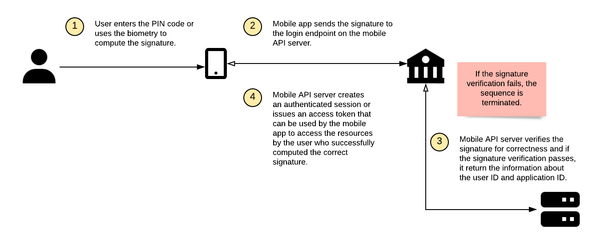

# Authentication in Mobile Banking Apps (SCA)

<!-- AUTHOR joshis_tweets 2020-05-04T00:00:00Z -->
<!-- SIDEBAR _Sidebar.md sticky -->
<!-- TEMPLATE tutorial -->

In this tutorial, we will show you how to implement authentication into your mobile banking or fintech apps.

This tutorial has four parts:

- **Mobile Authentication Overview**
- [Tutorial for Server Side Developers](Server-Side-Tutorial.md)
- [Tutorial for iOS Developers](iOS-Tutorial.md)
- [Tutorial for Android Developers](Android-Tutorial.md)

## Mobile Authentication Overview

Authentication is a process of verifying the user's identity. It is usually performed to manage access to an application (login) or in order to approve a transaction, such as payment, using a reliable user identity proof. In case of the banking systems, managing access to systems and transaction signing are two critical requirements from both security and compliance perspective.

In the terms of the security, a well-designed authentication and operation approval system improves the confidentiality of the financial information, since only the correct users can access the particular account information. At the same time, it prevents money loss by protecting the financial transactions from being manipulated, since each payment has a strong cryptographic proof (such that cannot be forged, replayed, or connected to other transaction) of the user who approved it.

In the terms of the compliance, these mechanisms are required for example to comply with the European PSD2 legislation and its requirements on Strong Customer Authentication (SCA).

Last but not least, correctly designed cryptographic protocol for authentication usually improves the user experience, since the users can login or approve a payment with a simple PIN code instead of a long password, or with a biometric authentication.

[Mobile Security Suite](https://www.wultra.com/mobile-security-suite) is a plugin (SDK) for iOS and Android apps that - together with its server counterparts - covers the authentication and transaction signing functionality, allowing the end-users to login or approve payments using PIN code or biometry. It also covers all related use-cases, such as authentication element lifecycle (active, blocked, removed), PIN code change, biometry settings, etc. It uses [an open-source cryptographic PowerAuth protocol](https://github.com/wultra/powerauth-crypto) that is trusted by leading banks and financial institutions to back the authentication-related processes with strong cryptography.

## Activation

When a user downloads a mobile app for iOS or Android, this app is always a blank, non-personalized app. Basically, it is the same app for all users who download it. In order to connect the app with the user account, the user needs to "activate" the application first. This requires an interplay between the mobile app and server components, as well as a user providing credentials as an identity proof that could be used to identify the user reliably. We call this initial process **Activation**. Sometimes, it is also referred to as registration, enrollment, or personalization, and these terms can be used interchangeably with confidence.

In the case of Mobile Security Suite, the activation can be either performed fully on the mobile device (it is both initiated and completed on the mobile device), or in an "out-of-band" mode (initiated externally, for example, in the Internet banking, and completed both on the mobile device and in the external systems that initiated the activation).

### On-Device Activation

The high-level overview of the on-device activation steps is captured in this diagram:

As you can see, this diagram is relatively simple and straight-forward.

### Out-of-Band Activation

The high-level overview of the out-of-band activation steps is captured in this diagram:

While this diagram seems a bit more complex, the process is still very simple. The main difference is in the initiation of the process, where some external system, in our case the Internet banking, must first fetch the activation code (usually represented by a QR code, link with the parameter, or a text value). Later in the process, the Internet banking must also confirm the activation in order to make it useable on the just activated device.

Unlike in the on-device activation, no external system for verifying the credentials is needed in this case, since the user is already signed in to the Internet banking, and the activation code is generated specifically for that particular user.

To understand this out-of-band process better, you can look at the activation code as at a special one-time token-like credentials for a given user that are managed in the mobile management server and will expire after a short time.

<!-- begin box info -->
In both activation scenarios, the mobile app only communicates with the mobile enrollment server, never with the mobile management server. Only back-end applications communicate with the mobile management server.
<!-- end -->

## Transaction Signing

After the user activates the mobile app, it is ready for its main use case: **Transaction signing**.

The transaction signing is technically used for all types of operations - login, payments, configuration changes, etc. In all cases, the user needs to enter a PIN code set during the activation, or use biometry on the mobile device to compute a data signature. The signature is later verified on the server-side.

In the case of the login, the signature is computed only from the authentication factors. In the case of the payment (or other similar operation that generally has some data assigned to it), the both authentication factors and operation data is reflected in the resulting signature.

<!-- begin box info -->
The PSD2 legislation uses the term "dynamic linking" for this dependency of the signature on the operation data. PSD2 mandates using at least the other party account number and a payment amount as data that enters the signature (in PSD2 terminology, the "Authentication Code"), and the use of at least two authentication factors.
<!-- end -->

The number of authentication attempts is limited. If the signature verification fails, the number of remaining accounts is decremented. If there are no more attempts left, the activation is blocked.

### Login

The overview diagram of the transaction signing for login is captured below:

### Payment approval

The overview diagram of the transaction signing for payment approval is not much different from the login diagram:

The main difference is that after a successful signature verification, the payment is sent for the further processing after being approved by a given user. The invisible difference is that the signature is computed using the payment data.

## Other Use-Cases

Of course, every authentication and transaction signing system also implements some typical auxiliary use-cases, such as:

- Activation status check.
- Activation blocking and removal.
- Password / PIN code change.
- Biometric authentication setup.
- End-to-end payload encryption.

Please refer to the detailed documentation for more information about those.

## Resources

Of course, you can always find more details in our reference documentation:

- [Cryptography Specification](https://github.com/wultra/powerauth-crypto)
- [PowerAuth Server Documentation](https://github.com/wultra/powerauth-server)
- [Server-Side Integration Libraries Documentation](https://github.com/wultra/powerauth-restful-integration)
- [Mobile SDK for iOS and Android Documentation](https://github.com/wultra/powerauth-mobile-sdk)

## Continue Reading

Proceed with one of the following chapters:

- [Tutorial for Server Side Developers](Server-Side-Tutorial.md)
- [Tutorial for iOS Developers](iOS-Tutorial.md)
- [Tutorial for Android Developers](Android-Tutorial.md)
