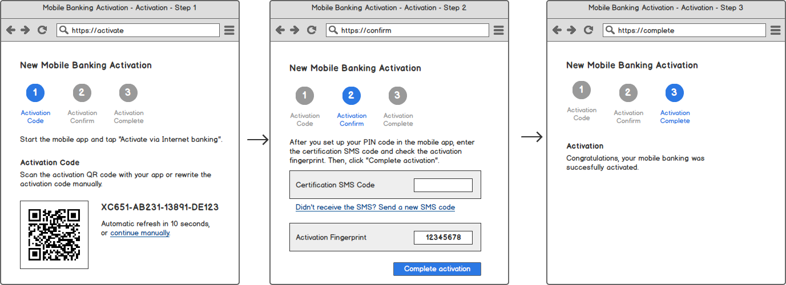
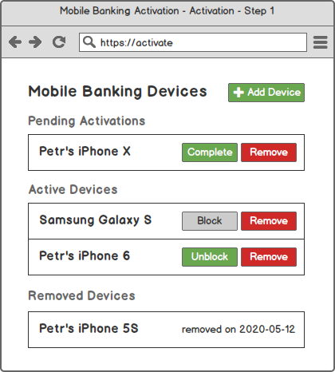

# Mobile-First Authentication&#58; Integrating with Your Back-End Applications

<!-- AUTHOR joshis_tweets 2023-12-29T00:00:00Z -->
<!-- SIDEBAR _Sidebar_Server.md sticky -->
<!-- TEMPLATE tutorial -->

In this tutorial, we will show you how to integrate API published by our server components with your back-end applications.

## Prerequisites

This tutorial assumes that you have:

- Read and understood the [Problem Overview](Readme.md) chapter
- Followed [Installing Server-Side Components](Server-Side-Tutorial-Deployment.md) chapter

## Task Overview

When integrating with our services, you need to perform the following tasks:

- Review the components
- Implement mobile device registration
- Implement mobile device self-service
- Implement protected API resources
- Implement out-of-band approvals (push approvals)

## Review The Components

The following diagram captures the internal architecture of the installed back-end system:


While the internal components and calls are not very important, there are two components you should pay attention to:

- **PowerAuth Cloud** - Proxy application available from the internal network published via `/powerauth-cloud` context, must not be published to the public internet. Access is protected with basic HTTP authentication.
- **Enrollment Server** - Application published to the public internet via the `/enrollment-server` context that is accessed by the mobile clients.

During your integration effort, you only need to call PowerAuth Cloud services on `/powerauth-cloud` context. The Enrollment Server is intended for the mobile apps, and so you do not need to call any services on `/enrollment-server` context.

## Implement Mobile Device Registration

The recommended way to register a new mobile device is using an activation code.

An example of the screen flow in the Internet banking is captured below:



However, the activation code can be used for registering mobile devices via any channel, including mobile-only flows.

### Obtaining the Activation Code

You can generate a new activation code for a particular user ID (this is how the user identity is connected with the activation code) by calling the following service with an integration user credentials:

```sh
curl -X 'POST' \
  'http://localhost:8080/powerauth-cloud/v2/registrations' \
  -u integration-user:${INTEGRATION_PASSWORD} \
  -H 'Content-Type: application/json' \
  -d '{
    "userId": "end-user-1234",
    "appId": "my-application"
}'
```

Note that we used `my-application` as the app identifier `appId`, as this is the value we used as example in [Installing Server-Side Components](Server-Side-Tutorial-Deployment.md) chapter. Also, the `userId` value is an arbitrary example value. You must use a user identifier which is specific to your systems.

The call returns the following response:

```json
{
  "activationQrCodeData": "V42UC-HRMDV-VW57V-6LEYA#MEUCIQDswIufeNdNhkQjcZjmECeqZmYjMTHicOtixz2CAVgGIAIgc8rBeJJ22Wc2rZwj128uREZAawVD0iBMXGkl/+UPCyI=",
  "activationCode": "V42UC-HRMDV-VW57V-6LEYA",
  "activationCodeSignature": "MEUCIQDswIufeNdNhkQjcZjmECeqZmYjMTHicOtixz2CAVgGIAIgc8rBeJJ22Wc2rZwj128uREZAawVD0iBMXGkl/+UPCyI=",
  "registrationId": "c8a1faf6-2dcd-4a66-b309-43a57afa8ca6"
}
```

#### Mobile-Only Flows

When implementing a mobile-only flows, you might want to automatically commit a registration after the mobile device registers itself. To accomplish this, you need to set the **activation OTP** and specify the **activation OTP validation mode**. You must obtain any OTP value `${OTP}` (it can even be randomly generated just-in-time, as we manage the hashed value), and call:

```sh
curl -X 'POST' \
  'http://localhost:8080/powerauth-cloud/v2/registrations' \
  -u integration-user:${INTEGRATION_PASSWORD} \
  -H 'Content-Type: application/json' \
  -d '{
    "userId": "end-user-1234",
    "appId": "my-application",
    "otp": "${OTP}",
    "otpValidation": "ON_KEY_EXCHANGE",
}'
```

After receiving the same response as above, you need to deliver the activation OTP to the mobile device, i.e., by sending it via SMS, email, or - if necessary - over the data channel, besides providing the activation code value. Mobile app will then use the activation OTP alongside the activation code and, as a result, the related registration will be auto-committed during the key exchange (as specified by the `ON_KEY_EXCHANGE` value).

### Polling the Registration Status

You can check for the registration status at any time by calling the following endpoint with the previously obtained registration ID as the URI parameter:

```sh
curl -X 'GET' \
  'http://localhost:8080/powerauth-cloud/v2/registrations/c8a1faf6-2dcd-4a66-b309-43a57afa8ca6' \
  -u integration-user:${INTEGRATION_PASSWORD} \
  -H 'Content-Type: application/json'
```

The response of the call may slightly differ based on a specific registration status. For example, for a just created registration in the `CREATED` status, the response will look like this:

```json
{
  "registrationId": "c8a1faf6-2dcd-4a66-b309-43a57afa8ca6",
  "registrationStatus": "CREATED",
  "applicationId": "my-application",
  "flags": [],
  "timestampCreated": 1703848436819,
  "timestampLastUsed": 1703848436819,
  "userId": "end-user-1234",
  "activationQrCodeData": "V42UC-HRMDV-VW57V-6LEYA#MEQCIFbjWRyb7JfGxQjHMTYlPQVPClmt9fDX78i1088SaLd4AiAbiQktkwiGxPELvXKmeMZmR4ms/Fbj1npdU4angLzr4w==",
  "activationCode": "V42UC-HRMDV-VW57V-6LEYA",
  "activationCodeSignature": "MEUCIQDswIufeNdNhkQjcZjmECeqZmYjMTHicOtixz2CAVgGIAIgc8rBeJJ22Wc2rZwj128uREZAawVD0iBMXGkl/+UPCyI="
}
```

All statuses and response structures are well documented in the [RESTful API reference](/components/powerauth-cloud/develop/documentation/API-Reference-Multi-Device#get-v2registrationsregistrationid). However, you should be primarily interested in the `registrationStatus` parameter:

- `CREATED` - The registration was just created. You can re-obtain the activation code data in this state.
- `PENDING_COMMIT` - The mobile device was registered but the registration must be committed on the server side. If relevant, you can display `activationFingerprint` at this stage so that the user can compare its value with the one displayed in the mobile app.
- `ACTIVE` - The registration is active and ready to be used.
- `BLOCKED` - The registration is blocked and needs to be unblocked to be usable.
- `REMOVED` - The registration is expired or non-existing.

<!-- begin box info -->
Besides polling, the system also supports [registration callbacks](/components/powerauth-cloud/develop/documentation/Callback-API) to provide an instant response. You can register your webhooks that will be called whenever registration status changes. We still recommend having polling mechanism in place as a backup, as webhooks may not be reliable.
<!-- end -->

### Committing the Registration

If the registration arrives in the `PENDING_COMMIT` state, you must commit it by calling the commit endpoint on the server side. You can condition the commit call by some other authentication mechanism, for example, when registering via the Internet banking, you can only call the commit endpoint if an independelty sent SMS OTP is correctly validated. Whenever you are ready to commit the registration, call:

```sh
curl -X 'POST' \
  'http://localhost:8080/powerauth-cloud/v2/registrations/c8a1faf6-2dcd-4a66-b309-43a57afa8ca6/commit' \
  -u integration-user:${INTEGRATION_PASSWORD} \
  -H 'Content-Type: application/json' \
  -d '{
}'
```

## Implement Mobile Device Self-Service

The end user should have an overview of the devices that are activated with his/her account. This is usually done by implementing a specific "self-service" section in the Internet banking. The goal of such section should be to allow typical administrative tasks, such as:

- Listing the current active devices.
- Blocking or removing an active device.

The same functionality is usually implemented in the banking back-office application, so that the bank operators can manage mobile devices for their clients.

### Listing Active Devices

To list all active devices for given user, you can call the registration list endpoint with the user ID as a query parameter:

```sh
curl -X 'GET' \
  'http://localhost:8080/powerauth-cloud/v2/registrations?userId=end-user-1234' \
  -u integration-user:${INTEGRATION_PASSWORD} \
  -H 'Content-Type: application/json'
```

<!-- begin box info -->
Note that this call returns only activations in active states. Use `&removed=true` as an additional query parameter to obtain all registrations.
<!-- end -->

The response is a simple list with registrations:

```json
{
  "registrations": [
    {
      "registrationId": "ebfddf4d-f1ba-4d15-9300-83c16cd60f50",
      "registrationStatus": "BLOCKED",
      "blockedReason": "DEVICE_LOST",
      "applicationId": "my-application",
      "name": "John's iPhone",
      "platform": "ios",
      "deviceInfo": "iPhone10,6",
      "flags": [],
      "timestampCreated": 1655754869885,
      "timestampLastUsed": 1655760905202
    },
    {
      "registrationId": "c8a1faf6-2dcd-4a66-b309-43a57afa8ca6",
      "registrationStatus": "ACTIVE",
      "applicationId": "my-application",
      "name": "John's iPhone",
      "platform": "ios",
      "deviceInfo": "iPhone10,6",
      "flags": [],
      "timestampCreated": 1702489047761,
      "timestampLastUsed": 1702489047761
    }
  ]
}
```

You can use the data to show the list of devices in any administrative user interface, on web or mobile. Below is a mockup for the Internet banking capturing most of the possible states:



### Block, Unblock and Remove Devices

In case you want to block an active registration, unblock a blocked one, or remove the registration completely, you can do so by calling our APIs.

To block the registration, you can call:

```sh
curl -X 'PUT' \
  'http://localhost:8080/powerauth-cloud/v2/registrations/c8a1faf6-2dcd-4a66-b309-43a57afa8ca6' \
  -u integration-user:${INTEGRATION_PASSWORD} \
  -H 'Content-Type: application/json' \
  -d '{
    "change": "BLOCK"
}'
```

To unblock the registration, you can call:

```sh
curl -X 'PUT' \
  'http://localhost:8080/powerauth-cloud/v2/registrations/c8a1faf6-2dcd-4a66-b309-43a57afa8ca6' \
  -u integration-user:${INTEGRATION_PASSWORD} \
  -H 'Content-Type: application/json' \
  -d '{
    "change": "UNBLOCK"
}'
```

To remove the registration, you can call:

```sh
curl -X 'DELETE' \
  'http://localhost:8080/powerauth-cloud/v2/registrations/c8a1faf6-2dcd-4a66-b309-43a57afa8ca6' \
  -u integration-user:${INTEGRATION_PASSWORD} \
  -H 'Content-Type: application/json'
```

## Implement Protected API Resources

To implement use-cases such as login to mobile banking or making a payment via a mobile banking app, you need to publish API resources from your back-end components that can - besides performing the use-cases according to your business logic - verify the authentication codes produced by mobile applications against our server components.

### Verifying the Authentication Code Directly

The principle of all the use-cases related to transaction signing in the mobile app is the same:

- The mobile app sends an HTTP request with request body to an API endpoint, providing the authentication code in the `X-PowerAuth-Authorization` header.
- The server side must verify the request, namely:
    - Obtain the HTTP method (i.e., `POST`) and URI identifier (i.e., `/login`).
    - Fetch the authentication code from the `X-PowerAuth-Authorization` header.
    - Extract raw HTTP request body (i.e., `{}`) to obtain data (bit-by-bit) that was used for the authentication code.
    - Validate these values against our service (providing binary request body data as Base64 encoded value).

An example call for the authentication code verification can look like this:

```sh
curl -X 'POST' \
  'http://localhost:8080/powerauth-cloud/v2/signature/verify' \
  -u integration-user:${INTEGRATION_PASSWORD} \
  -H 'Content-Type: application/json' \
  -d '{
    "method": "POST",
    "uriId": "/login",
    "authHeader": "PowerAuth pa_activation_id=\"c8a1faf6-2dcd-4a66-b309-43a57afa8ca6\",pa_application_key=\"Z19gyYaW5kb521fYWN0aXZ==\", pa_nonce=\"kYjzVBB8Y0ZFabxSWbWovY==\", pa_signature_type=\"possession_knowledge\" pa_signature=\"MDEyMzQ1Njc4OWFiY2RlZjAxMjM0NTY3ODlhYmNkZWY=\", pa_version=\"3.1\"",
    "requestBody": "e30="
}'
```

<!-- begin box warning -->
Note that the `uriId` is a constant pre-shared between the mobile app and server. We recommend the name is derived from the path of the API resource. Request body bytes must be fetched from the request precisely. Any re-serialization or similar alternations can cause the data on the server to differ from the data used in the mobile app, which will result in failed verification of the authentication code.
<!-- end -->

<!-- begin remove -->
### Building the Login Endpoint

To create the authenticated session, we will publish a simple `/login` endpoint that uses the `POST` HTTP method and is protected by the PowerAuth authentication code. Note that we used the `@PowerAuth` annotation with a `resourceId` value equal to `/login`. You need to pass the `resourceId` value to your mobile app developer in order to configure the request signing on the mobile app end.

<!-- begin box warning -->
While the `resourceId` value is the same as the endpoint name in the example, you may actually choose any arbitrary String value for the `resourceId`. Using the same value as the endpoint name is convenient. However, it is also a big source of confusion among the developers since they sometimes mix up the values.
<!-- end -->

Upon the successful user authentication, the instance of `PowerAuthApiAuthentication` will be automatically populated in the method parameter. This object extends `AbstractAuthenticationToken` from Spring Security, and so it can be used directly as an authentication object in the `SecurityContextHolder`.

Here is the full login controller code:

```java
@RestController
public class AuthenticationController {

    @PostMapping(value = "/login")
    @PowerAuth(resourceId = "/login")
    public String login(PowerAuthApiAuthentication auth) throws PowerAuthAuthenticationException {
        if (auth != null) {
            // Create an authenticated session
            SecurityContextHolder.getContext().setAuthentication((Authentication) auth);
            return "OK";
        } else {
            // Handle authentication failure using some exception
            throw new AuthenticationException();
        }
    }

}
```

### Building the Payment Approval Endpoint

We will now publish a `/secure/payment` endpoint that uses the `POST` HTTP method and that is protected by both the authenticated session and the PowerAuth authentication code. We are making an optional assumption in this tutorial that the users need to be authenticated before they can submit a payment. Again, we used the `@PowerAuth` annotation with a `resourceId` value. This time, however, we used the `/secure/payment` value to denote that this operation is a different operation from the `/login` operation we built earlier.

The payment approval endpoint also contains a payment object as the `@RequestBody` instance. Bytes (byte-by-byte) of the request body are used during the authentication code verification. Upon the successful authentication code verification, the instance of `PowerAuthApiAuthentication` will be automatically populated in the method parameter. This time, use the object to obtain the user who authorized the particular payment, to see if the user can actually approve the payment. If everything checks out, you can then send the payment for the processing using your proprietary payment processing method.

Here is the full payment approval controller code:

```java
@RestController("/secure")
public class SecureController {


    @PostMapping("/payment")
    @PowerAuth(resourceId = "/secure/payment")
    public String approvePayment(@RequestBody Payment payment, PowerAuthApiAuthentication auth) throws PowerAuthAuthenticationException {
        if (auth != null) {

            // Obtain the user ID
            String userId = auth.getUserId();

            // Check if the user can perform the given payment
            if (userCanPerformPayment(userId, payment)) {

                // Submit the payment for the processing
                sendPayment(userId, payment);
            } else {
                // Handle authorization failure
                throw new AuthorizationException();
            }
            return "OK";
        } else {
            // Handle authentication failure
            throw new AuthenticationException();
        }
    }

    private void sendPayment(String userId, Payment payment) {
        // Your logic to process the payment approved by user with given ID
    }

    private boolean userCanPerformPayment(String userId, Payment payment) {
        // Your logic to evaluate user access rights to the payment
        return true;
    }
}
```
<!-- end -->

## Implement Out-of-Band Approvals

When initiating login or payment outside the mobile app, for example, in the web Internet banking, you can use our operations API to simplify out-of-band approvals via push notifications.

In our systems, **an operation** is any isolated, temporary, one-time activity that user should approve or reject. The flow is the same for any type of such an activity, be it login attempt approval, payment approval, or any other approval:

- Create a new operation for the specific user with given template and parameters
- Check the operation status to see the result of the operation

### Creating New Operation

You can create a new operation for a particular user by calling the following service with an integration user credentials:

```sh
curl -X 'POST' \
  'http://localhost:8080/powerauth-cloud/v2/operations' \
  -u integration-user:${INTEGRATION_PASSWORD} \
  -H 'Content-Type: application/json' \
  -d '{
    "userId": "end-user-1234",
    "template": "default.payment",
    "parameters": {
        "amount": "63.99",
        "currency": "EUR",
        "account": "CZ32493745329497374923"
    }
}'
```

Note that we specified `default.payment` as the `template` for the operation. Our systems support any templates with any template names, and each template can have specific set of string parameters. In this case, we have three parameters named `amount`, `currency` and `account`, but the names can differ based on the template and the use-case.

The call returns the following response:

```json
{
    "operationId": "bd75ce63-a89f-4258-b172-5e51ced8df14",
    "userId": "end-user-1234",
    "status": "PENDING",
    "template": "default.payment",
    "operationType": "payment",
    "parameters": {
        "amount": "63.99",
        "currency": "EUR",
        "account": "CZ32493745329497374923"
    },
    "failureCount": 0,
    "maxFailureCount": 5,
    "timestampCreated": 1703852368813,
    "timestampExpires": 1703852668813
}
```

You need to store the operation ID so that you can check the operation status later.

### Polling the Registration Status

You can check for the operation status at any time by calling the following endpoint with the previously obtained operation ID as the URI parameter:

```sh
curl -X 'GET' \
  'http://localhost:8080/powerauth-cloud/v2/operations/bd75ce63-a89f-4258-b172-5e51ced8df14' \
  -u integration-user:${INTEGRATION_PASSWORD} \
  -H 'Content-Type: application/json'
```

The response of the call may slightly differ based on a specific operation status. For example, for a just created operation in the `PENDING` status, the response will look like this:

```json
{
    "operationId": "bd75ce63-a89f-4258-b172-5e51ced8df14",
    "userId": "end-user-1234",
    "status": "PENDING",
    "template": "default.payment",
    "operationType": "payment",
    "parameters": {
        "amount": "63.99",
        "currency": "EUR",
        "account": "CZ32493745329497374923"
    },
    "additionalData": {},
    "failureCount": 0,
    "maxFailureCount": 5,
    "timestampCreated": 1703852368813,
    "timestampExpires": 1703852668813
}
```

All statuses and response structures are well documented in the [RESTful API reference](/components/powerauth-cloud/develop/documentation/API-Reference-Multi-Device#get-v2operationsoperationid). However, you should be primarily interested in the `status` parameter:

- `PENDING` - The operation was just created and is pending approval.
- `CANCELED` - The operation was canceled by calling the API to remove the operation.
- `EXPIRED` - The operation expired.
- `APPROVED` - The operation was actively approved by the user.
- `REJECTED` - The operation was actively rejected by the user.
- `FAILED` - The operation approval failed due to too many failed approval attempts.

<!-- begin box info -->
Besides polling, the system also supports [operation callbacks](/components/powerauth-cloud/develop/documentation/Callback-API) to provide an instant response. You can register your webhooks that will be called whenever operation status changes. We still recommend having polling mechanism in place as a backup, as webhooks may not be reliable.
<!-- end -->

## Continue Reading

You can proceed with one of the following chapters:

- [Problem Overview](Readme.md)
- [Installing Server-Side Components](Server-Side-Tutorial-Deployment.md)
- [Integrating with Your Back-End Applications](Server-Side-Tutorial-Integration.md)
- [Implementing Mobile-First Authentication on iOS](iOS-Tutorial.md)
- [Implementing Mobile-First Authentication on Android](Android-Tutorial.md)

## Resources

You can find more details our reference documentation:

- [Cryptography Specification](/components/powerauth-crypto)
- [PowerAuth Cloud](/components/powerauth-cloud)
- [Mobile Authentication SDK for iOS and Android](/components/powerauth-mobile-sdk)
- [Mobile Token SDK for iOS](/components/mtoken-sdk-ios)
- [Mobile Token SDK for Android](/components/mtoken-sdk-android)

