# Implementing the Server-Side for Authentication in Mobile Banking Apps (SCA)

<!-- AUTHOR joshis_tweets 2020-05-04T00:00:00Z -->

In this tutorial, we will show you how to deploy and implement back-end components for authentication in mobile banking or fintech apps. The tutorial prioritizes integration with Spring Boot but integration with other technologies, such as JavaEE or .NET, is also possible.

This tutorial has four parts:

- [Mobile Authentication Overview](Readme.md)
- **Tutorial for Server Side Developers**
- [Tutorial for iOS Developers](iOS-Tutorial.md)
- [Tutorial for Android Developers](Android-Tutorial.md)

## Prerequisites

This tutorial assumes, that you have:

- Read and understood the [Mobile Authentication Overview](Readme.md)
- [Java 11](https://jdk.java.net/) installation, or newer.
- [Apache Tomcat 9.0](https://tomcat.apache.org/download-90.cgi) installation.
- [PostgreSQL 12 database](https://www.postgresql.org/) installation.
- Java IDE for developing Spring Boot applications (we will use [IntelliJ Idea](https://www.jetbrains.com/idea/)).

_Note: PowerAuth Server supports various application servers and JPA 2.x compatible database engines. For the sake of simplicity, we decided to go with setup on Tomcat and PostgreSQL._

## Introduction

When implementing a server-side support for the Mobile Security Suite, you need to perform several tasks:

- Prepare the server infrastructure and database schema.
- Deploy and explore the server-side components.
- Implement mobile app management in the Internet banking.
- Customize the enrollment server to allow custom activations.
- Prepare an API resource server with protected resources.
- Test that everything works using the command-line tool.

This is the component view on the infrastructure we are building in this tutorial:

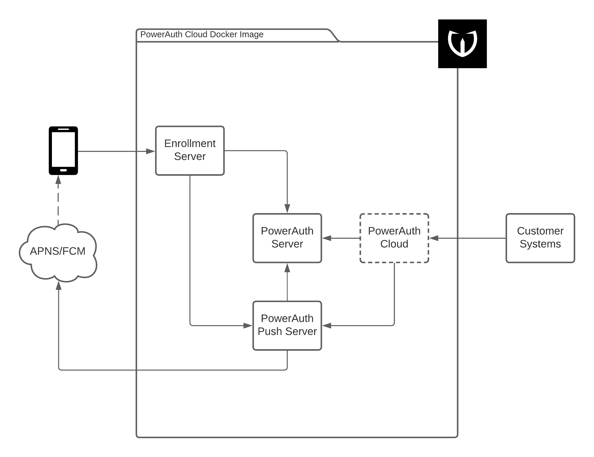

While the picture might look daunting, have no fear - everything is in fact straight-forward. Have a coffee, print the picture, and pay attention to the numbered blue boxes:

1. **PowerAuth Server** - This is the component that keeps track of registered devices and helps with the critical processes, such as activation or transaction signing. It should be deployed in the secure infrastructure, not accessible from the outside.
2. **PowerAuth Admin** - A GUI administration console for PowerAuth Server. While you could do the same thing using the PowerAuth Server API, this makes everything a bit more convenient.
3. **Extension for Internet banking** (or a back-office system) - Here, we will show you how to list and manage active devices and how to generate the activation code for the purposes of a new device activation.
4. **Enrollment Server** - A component that publishes an API for the mobile app in order to allow the device enrollment. We will show you how to deploy the vanilla version of the server (that supports activation using activation code) and how to extend the server with a custom activation method.
5. **API Resource Server** - A component that publishes protected API endpoints, such as login and payment approval. We will show you how to secure a resource in your Spring Boot application.

## Preparing the Infrastructure

Besides the Apache Tomcat 9.0 and PostgreSQL database installation and configuration, you need to perform several generic configuration tasks:

- Prepare the database schema, so that the required tables are in place.
- Add the required libraries to the Tomcat `/lib` folder.
    - PostgreSQL JDBC Connector library (JAR)
    - Bouncy Castle JCE Provider library (JAR)
- Restart Tomcat, to apply the changes.

### Preparing the Database Schema

Execute the following scripts in your PostgreSQL database to create the required tables:

- [PostgreSQL - Create Schema Script](https://github.com/wultra/powerauth-server/blob/develop/docs/sql/postgresql/create_schema.sql)

You can learn more about the database structure in our [detailed documentation](https://github.com/wultra/powerauth-server/blob/develop/docs/Database-Structure.md).

### Adding Required Libraries

To add the PostgreSQL JDBC library, copy the [PostgreSQL JDBC Driver JAR file](https://jdbc.postgresql.org/download.html) to `$CATALINA_HOME/lib` folder.

You can add the Bouncy Castle JCE provider the same way. Copy the [Bouncy Castle Provider JAR](https://www.bouncycastle.org/latest_releases.html) (`bcprov-jdk15on-${VERSION}.jar`) to `$CATALINA_HOME/lib` folder.

Restart the Apache Tomcat instance for these changes to take effect:



```sh
$CATALINA_HOME/bin/catalina stop
$CATALINA_HOME/bin/catalina start
```


```sh
$CATALINA_HOME/bin/catalina.sh stop
$CATALINA_HOME/bin/catalina.sh start
```


```sh
$CATALINA_HOME/bin/catalina.bat stop
$CATALINA_HOME/bin/catalina.bat start
```



## Deploy the Server-Side Components

For this tutorial, we will deploy just two components:

- [PowerAuth Server](https://github.com/wultra/powerauth-server) - The server responsible for mobile device management.
- [PowerAuth Admin](https://github.com/wultra/powerauth-admin) - The administration console for the PowerAuth Server.

### Deploy the PowerAuth Server

First, prepare the required configuration XML file called `powerauth-java-server.xml` ([here](./powerauth-java-server.xml) is a template for download). In a minimal configuration, the only thing you need to configure is the JDBC database connectivity properties:



```xml
<?xml version="1.0" encoding="UTF-8"?>
<Context>

    <!-- Database Configuration - JDBC -->
    <Parameter name="spring.datasource.driver-class-name" value="org.postgresql.Driver"/>
    <Parameter name="spring.datasource.url" value="jdbc:postgresql://localhost:5432/postgres"/>
    <Parameter name="spring.datasource.username" value="$YOUR_DB_USERNAME"/>
    <Parameter name="spring.datasource.password" value="$YOUR_DB_PASSWORD"/>

</Context>
```



_Note: All our applications are a common Spring Boot applications and therefore, you can configure any other well-known Spring Boot properties._

Next, copy the `powerauth-java-server.xml` configuration file to `$CATALINA_HOME/conf/Catalina/localhost/` folder. Tomcat automatically picks up the file and will use the configuration for the `/powerauth-java-server` context.

[Download the latest PowerAuth Server](https://github.com/wultra/powerauth-server/releases) (`powerauth-java-server.war` file) and copy the WAR file to `$CATALINA_HOME/webapps` folder.

You can now open [PowerAuth Server Welcome Page](http://localhost:8080/powerauth-java-server/) at [http://localhost:8080/powerauth-java-server/](http://localhost:8080/powerauth-java-server/) address.

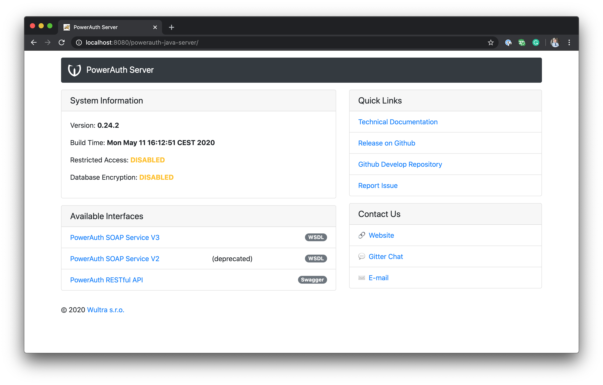

The welcome page shows the version info, important configuration properties, and links to important resources.

### Deploy the PowerAuth Admin

Deploying PowerAuth Admin, a GUI console for PowerAuth Server, follows a similar pattern as deploying the PowerAuth Server.

First, prepare an XML configuration file `powerauth-admin.xml` ([here](./powerauth-admin.xml) is a template for download). This time, the file only contains a single property: a SOAP interface address of the PowerAuth Server instance running on `localhost:8080` address.



```xml
<?xml version="1.0" encoding="UTF-8"?>
<Context>
    <Parameter name="powerauth.service.url" value="http://localhost:8080/powerauth-java-server/soap"/>
</Context>
```



Next, copy the `powerauth-admin.xml` configuration file to `$CATALINA_HOME/conf/Catalina/localhost/` folder. Tomcat automatically picks up the file and will use the configuration for the `/powerauth-admin` context.

[Download the latest PowerAuth Admin](https://github.com/wultra/powerauth-admin/releases) (`powerauth-admin.war` file) and copy the WAR file to `$CATALINA_HOME/webapps` folder.

You can now open [PowerAuth Admin](http://localhost:8080/powerauth-admin/) console at [http://localhost:8080/powerauth-admin/](http://localhost:8080/powerauth-admin/) address.

#### Preparing the Mobile App Credentials

You can use the PowerAuth Admin to generate the mobile app credentials. Mobile app developers will need those credentials in order to configure the mobile SDK. With the empty system, you can create your application simply by providing an "application name". Use some technical format for the application name, rather than a fancy visual name.

We will use `demo-application` as an app name:

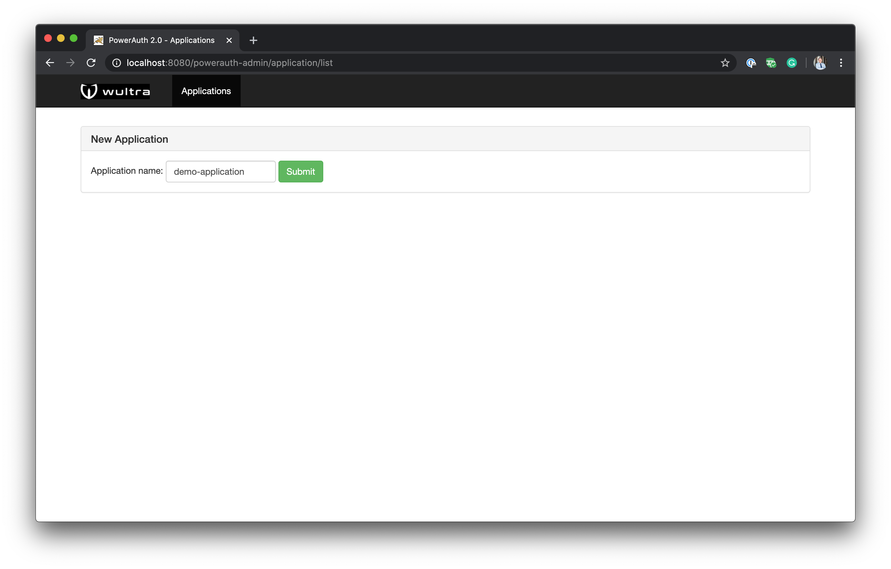

After submitting the new application, you will see the values of application key, application secret, and master server public key. Provide your mobile developers with those values, so that they can configure their mobile apps.

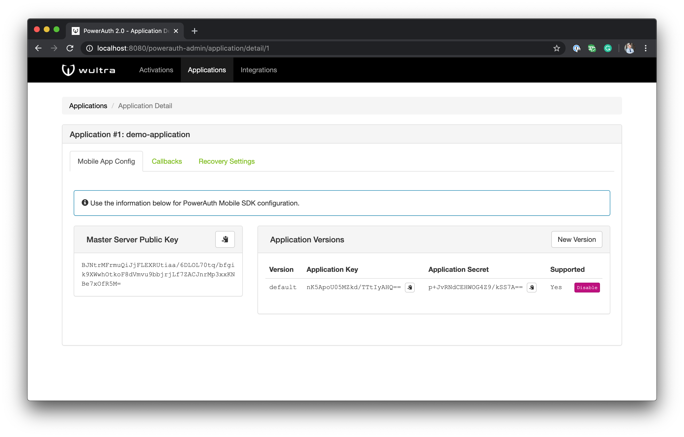

## Mobile App Management via the Internet Banking

The end user should have an overview of the devices that are activated with his/her account. This is usually done by implementing a specific "self-service" section in the Internet banking. The goal of such section should be to allow typical administrative tasks, such as:

- Creating a new activation via an activation code.
- Listing the current active devices.
- Blocking or removing an active device.

The same functionality is usually implemented in the banking back-office application, so that the bank operators can manage mobile devices for their clients.

### Using the PowerAuth SOAP Service Client

Of course, you can directly call the PowerAuth Server RESTful APIs - the Swagger with documentation is available from the PowerAuth Server Welcome Page. However, the easiest way to call the PowerAuth Server services is to use our client library. The library currently uses a SOAP protocol but from your perspective, this is fully transparent.

To add the library in your Maven project, use the following snippet:

```xml
<dependency>
    <groupId>io.getlime.security</groupId>
    <artifactId>powerauth-java-client-spring</artifactId>
    <version>${powerauth.version}</version>
</dependency>
```

You can then create a bean with the configured client:

```java
@Configuration
@ComponentScan(basePackages = {"io.getlime.security.powerauth"})
public class PowerAuthWebServiceConfiguration {

    @Bean
    public Jaxb2Marshaller marshaller() {
        Jaxb2Marshaller marshaller = new Jaxb2Marshaller();
        marshaller.setContextPath("io.getlime.powerauth.soap.v3");
        return marshaller;
    }

    @Bean
    public PowerAuthServiceClient powerAuthClient(Jaxb2Marshaller marshaller) {
        PowerAuthServiceClient client = new PowerAuthServiceClient();
        client.setDefaultUri("http://localhost:8080/powerauth-java-server/soap");
        client.setMarshaller(marshaller);
        client.setUnmarshaller(marshaller);
        return client;
    }
}
```

After that, you can simply `@Autowire` the object wherever needed:

```java
@Autowired
private PowerAuthServiceClient powerAuthServiceClient;
```

### Activation Using Activation Code

The easiest way to activate a mobile client app is using an activation code. You can generate a new activation code for a particular user (this is how the user identity is connected with the mobile app) by calling the services published by the PowerAuth Server.

Your internet banking first needs to generate the activation code for the logged in user, and after the user performs the key exchange on the mobile device, you need to commit the activation.

Generally, the process looks like this:

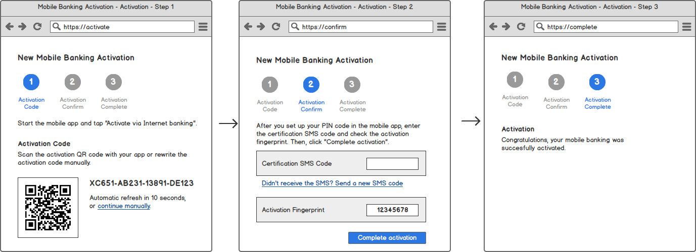

To generate the activation code, you can call:

```java
// Your actual user and application identifier
String userId = "1234";
Long applicationId = 1;

// Call the SOAP service
InitActivationResponse response = powerAuthServiceClient.initActivation(userId, applicationId);

// Get the activation code and activation code signature
String activationId = response.getActivationId(); // unique ID
String activationCode = response.getActivationCode();
String activationSignature = response.getActivationSignature();

// Prepare the QR code payload with the signed activation code.
// We use # to separate the two values in the QR code.
String qrCodeString = activationCode + "#" + activationSignature;
```

Now, generating the activation code is only one part of the issue. At the end of the process, you also need to commit the activation to make it usable. You should allow committing the activation as soon as the activation moves to the `PENDING_COMMIT` status. Activation moves to the state from the `CREATED` state as soon as the user completes the key exchange on the mobile device.

You can obtain the activation status at any time (either via periodic polling, or on a button click initiated by the user) by calling the `getActivationStatus` method:

```java
// Call the SOAP service with activation ID obtained earlier.
GetActivationStatusResponse response = powerAuthServiceClient.getActivationStatus(activationId);

// Get generic activation attributes
String activationId = activation.getActivationId(); // unique ID
String userId = response.getUserId();
Long appId = response.getApplicationId();
String activationName = response.getActivationName(); // may be empt
ActivationStatus status = response.getActivationStatus();

// For unfinished activations, you can also obtain the activation code again
String activationCode = activation.getActivationCode();
String activationSignature = activation.getActivationSignature();
String activationFingerprint = activation.getDevicePublicKeyFingerprint();
```

Of course, you can also receive the `REMOVED` status in a response. In such case, you should terminate the user flow and let the user start over.

In case the activation is in `PENDING_COMMIT` state, it is time to commit it. You can combine this step with some additional verification on your side, for example, checking a value of an SMS OTP code. You should also display the "activation fingerprint" - see the call to `getDevicePublicKeyFingerprint` method in the example above. This value is also displayed on the mobile device, user should check it to confirm that the key exchange during the activation was completed correctly.

```java
// Call the SOAP service with activation ID obtained earlier.
CommitActivationResponse response = powerAuthServiceClient.commitActivation(activationId);
```

### Listing Active Devices

To list all active devices for given user, use the `getActivationListForUser` method:

```java
// Your actual user and application identifier
String userId = "1234";

// Call the SOAP service.
List<Activations> response = powerAuthServiceClient.getActivationListForUser(userId);

for (Activations activation : response) {
    String activationId = activation.getActivationId(); // unique ID
    String userId = response.getUserId();
    Long appId = response.getApplicationId();
    String activationName = response.getActivationName(); // may be empty
    ActivationStatus status = response.getActivationStatus();
}

```

Note that this call returns activations in all states (including removed or not completed) for all applications. You can filter out only the activations you need to be displayed in your list, or select a more specific method on the client instance.

The resulting list visualization is up to you, here is a generic mockup capturing most of the possible states:

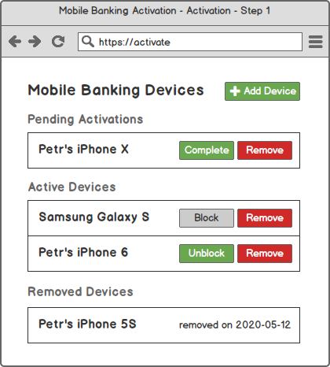

### Block, Unblock and Remove Devices

In case you want to block an active activation, unblock a blocked one, or remove the activation completely, there are a single line methods for that:

```java
// Short way to block the activation.
BlockActivationResponse response = powerAuthServiceClient.blockActivation(activationId, blockedReason);

// Short way to unblock the activation
UnblockActivationResponse response = powerAuthServiceClient.unblockActivation(activationId);

// Short way to remove the activation
RemoveActivationResponse response = powerAuthServiceClient.removeActivation(activationId);
```

When blocking the activation, you may specify a reason of why the activation is blocked. This can be `null` or any string you chose. We only have one reserved value of `"MAX_FAILED_ATTEMPTS"` for activations blocked because user authentication failed too many times.

## Deploying the Enrollment Server

Enrollment Server is the component that the mobile app actually calls. No calls are performed from the mobile app to the PowerAuth Server - this component should be deployed in a secure infrastructure.

**For the sake of simplicity, we will deploy all components into a single Tomcat instance. However, you should use two Tomcat instances for the production deployment.**

This is the part where you might need to start with an actual programming, since the enrollment process can be customized. For example, you can use custom user credentials as an identity proof for the enrollment - we will show you that part.

### Clone the Git Repository

Start by cloning the Enrollment Server git repository and switching into the project folder:

```sh
git clone https://github.com/wultra/enrollment-server.git
cd enrollment-server
```

You can use the version from the `develop` branch but this might get tricky, since you would have to install our development dependencies. Therefore, we suggest using a version from some of the release branches or - ideally - tags, for example:

```sh
# Replace the version number with the desired version.
git checkout tags/0.24.0 -b tags/0.24.0
```

### Building the Project

The project uses Maven for the dependency management and project builds. You can build project simply by calling a `mvn package` command:

```sh
mvn clean package
```

The resulting output artifact is `./target/enrollment-server-0.24.0.war`. You can rename the file to just `enrollment-server.war`.

### Deploying a Vanilla Enrollment Server

Deploying Enrollment Server follows a similar pattern as deploying the PowerAuth Server and PowerAuth Admin.

First, prepare an XML configuration file `enrollment-server.xml` ([here](./enrollment-server.xml) is a template for download). The file again only contains a single property: a SOAP interface address of the PowerAuth Server instance running on `localhost:8080` address.



```xml
<?xml version="1.0" encoding="UTF-8"?>
<Context>
    <Parameter name="powerauth.service.url" value="http://localhost:8080/powerauth-java-server/soap"/>
</Context>
```



Next, copy the `enrollment-server.xml` configuration file to `$CATALINA_HOME/conf/Catalina/localhost/` folder. Tomcat automatically picks up the file and will use the configuration for the `/enrollment-server` context.

Copy the `enrollment-server.war` file you just built to `$CATALINA_HOME/webapps` folder.

You can now open [Enrollment Server Swagger UI](http://localhost:8080/enrollment-server/swagger-ui.html) console at [http://localhost:8080/enrollment-server/swagger-ui.html](http://localhost:8080/enrollment-server/swagger-ui.html) address to see the published resources.

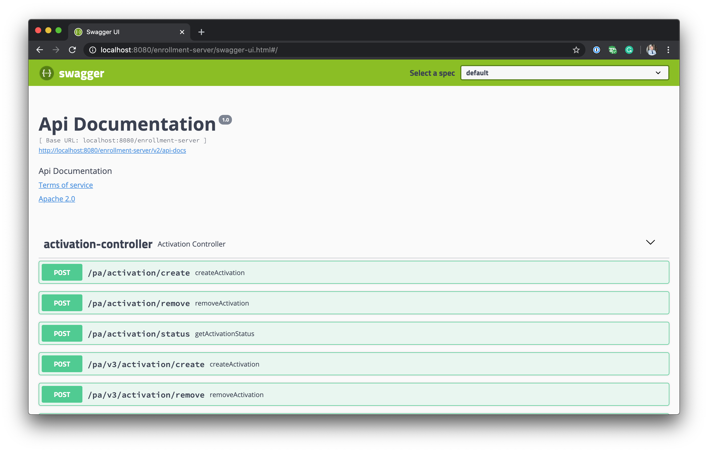

You can then provide your mobile app development team with the Enrollment Server base URL, which they need for their mobile app configuration.

### Custom Activation in Enrollment Server

Until now, the Enrollment Server only uses the default (built-in) functionality and activation mechanisms. Specifically, only activation via activation code and activation via recovery code are present. In this part of the tutorial, we will show you how to implement activation using custom credentials.

Specifically, we will implement a mechanism that will allow the user to activate the mobile app via:

- **Username** - Any user identifier, such as e-mail or a client number.
- **Password** - User's password, for example, for the Internet banking.
- **OTP Code** - A one-time password that user obtained elsewhere, for example, from the HW token authenticator or via an SMS message.

Since these credentials are specific for you and your systems, you need to have your own service (denoted as `MyService` in the example below) to verify those credentials and translate them to a user ID in case authentication was successful.

To start with the customizations, open the IDE of your choice and import the project. Most Java IDEs support Maven out of the box, so this part should be easy. After importing the project, you should see the default project structure.

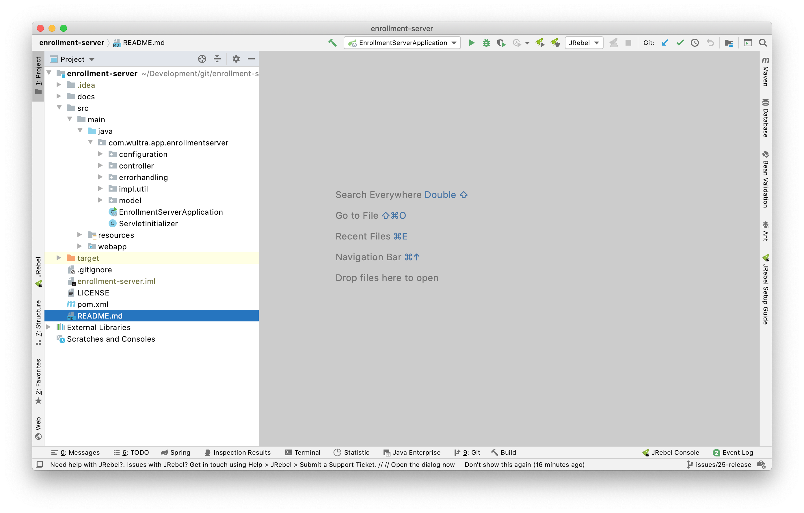

Start by adding a new `com.wultra.app.enrollmentserver.customization` package and create a new `MyActivationProvider` class that implements the `CustomActivationProvider` interface. In this tutorial, we will only implement two overriden methods:

- `lookupUserIdForAttributes` - This is a method that translates provided credentials (user identity proof) to a particular user ID. This method may either return `null` in case credentials do not match, or throw a new `PowerAuthActivationException`.
- `shouldAutoCommitActivation` - This method specifies if the activation should be automatically committed after the key exchange, or if a cooperation of some other system is required (for example, confirming the activation via the Internet banking). In our case, we will implement this method so that it auto-commits activation after custom activation is processed.



```java
@Service
public class MyActivationProvider implements CustomActivationProvider {

    /**
     * Your identity service that can be used to verify the user credentials.
     */
    private final MyIdentityService myIdentityService;

    @Override
    public String lookupUserIdForAttributes(Map<String, String> identityAttributes) throws PowerAuthActivationException {
        // Fetch the user's credentials.
        String username = identityAttributes.get("username");
        String password = identityAttributes.get("password");
        String otp      = identityAttributes.get("otp");

        // Verify the credentials using your identity service.
        String userId = myIdentityService.verifyCredentials(username, password, otp);

        // If the credentials verification failed, throw an exception.
        if (userId == null) {
            throw new PowerAuthActivationException("Authentication failed");
        }

        // ... otherwise, return the user ID of an authenticated user.
        return userId;
    }

    @Override
    public boolean shouldAutoCommitActivation(Map<String, String> identityAttributes, Map<String, Object> customAttributes, String activationId, String userId, ActivationType activationType) throws PowerAuthActivationException {
        // Automatically commit activation for a CUSTOM activation type.
        // You can use more request attributes, either in identityAttributes or
        // customAttributes, for a more fine-grained control.
        return ActivationType.CUSTOM.equals(activationType);
    }
}
```



And that's it! Your enrollment server will now process the custom activation credentials sent from the mobile clients, allowing an activation via the custom credentials. You can now build the project again and deploy the Enrollment Server just as you did earlier.

## Preparing API Resource Server With Protected Resources

Finally, the last implementation part you need to take care of is publishing the protected API resources consumed by the mobile app. Usually, this is done by publishing new endpoints in an existing Spring application. For the simplicity, we will start with creating a new Spring Boot project.

### Create New Spring Boot Project

Let's create a new Spring Boot project first.

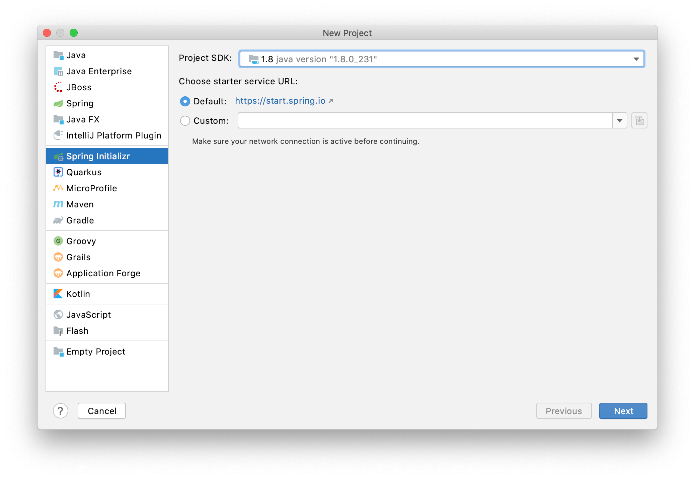

Make sure to select "WAR" packaging.


Select at least the "Spring Web" and "Spring Security" dependencies.

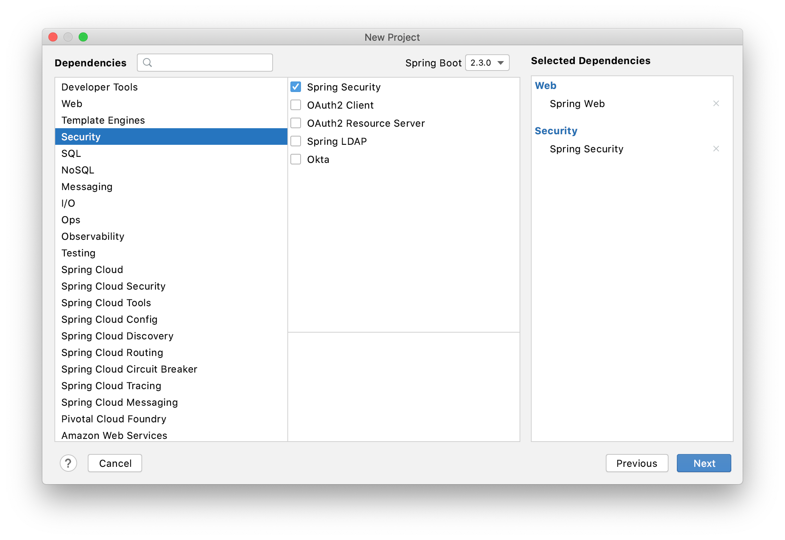

And finally, name the project and select an appropriate location.

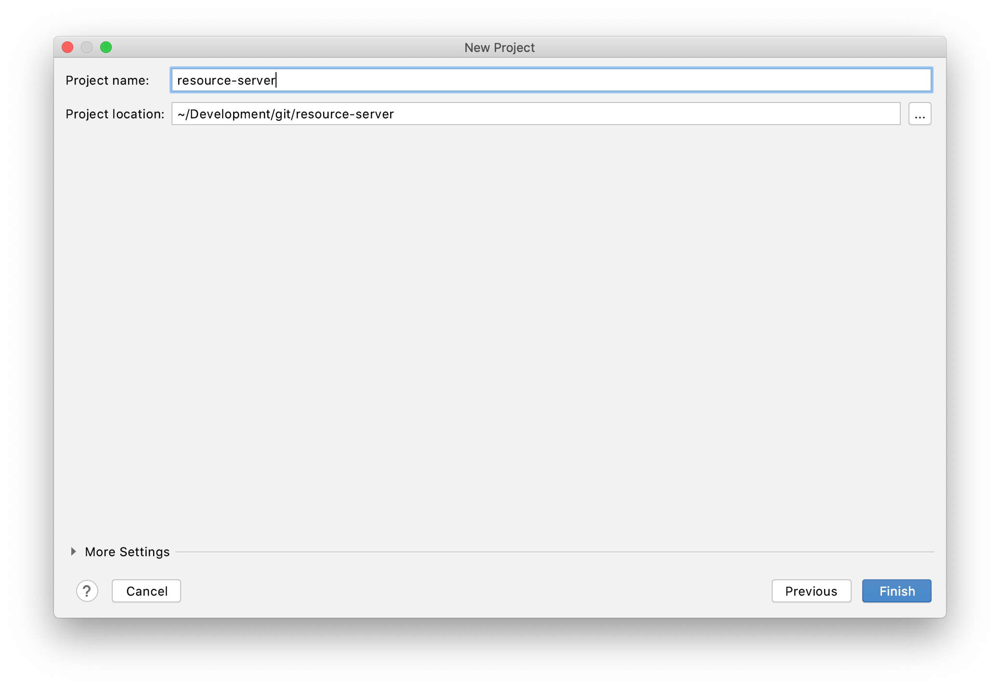

You will end up with a clean, simple project.

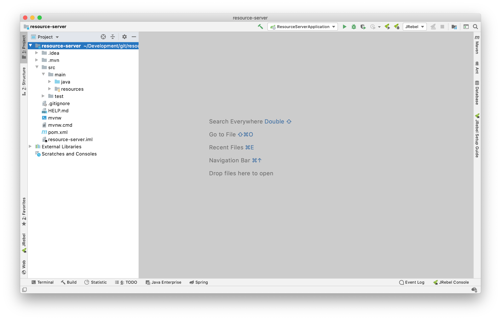

### Configuring the Components

First, we need to open the `pom.xml` file and add the following dependency:

```xml
<dependency>
    <groupId>io.getlime.security</groupId>
    <artifactId>powerauth-restful-security-spring-annotation</artifactId>
    <version>0.24.0</version>
</dependency>
```

This dependency brings support for PowerAuth-Spring magic that will make integration work seamlessly.

Next, you can create the configuration file for the PowerAuth service client, so that the application is able to communicate with the PowerAuth Server. The components will automatically pick the bean up.

```java
@Configuration
@ComponentScan(basePackages = {"io.getlime.security.powerauth"})
public class PowerAuthConfig {

    @Bean
    public Jaxb2Marshaller marshaller() {
        Jaxb2Marshaller marshaller = new Jaxb2Marshaller();
        marshaller.setContextPath("io.getlime.powerauth.soap.v3");
        return marshaller;
    }

    @Bean
    public PowerAuthServiceClient powerAuthClient(Jaxb2Marshaller marshaller) {
        PowerAuthServiceClient client = new PowerAuthServiceClient();
        client.setDefaultUri("http://localhost:8080/powerauth-java-server/soap");
        client.setMarshaller(marshaller);
        client.setUnmarshaller(marshaller);
        return client;
    }

}
```

To register all required PowerAuth components, create a Java class that implements the `WebMvcConfigurer` interface and creates all the necessary beans:

```java
@Configuration
public class WebApplicationConfig implements WebMvcConfigurer {

    @Bean
    public PowerAuthWebArgumentResolver powerAuthWebArgumentResolver() {
        return new PowerAuthWebArgumentResolver();
    }

    @Bean
    public PowerAuthEncryptionArgumentResolver powerAuthEncryptionArgumentResolver() {
        return new PowerAuthEncryptionArgumentResolver();
    }

    @Bean
    public PowerAuthAnnotationInterceptor powerAuthInterceptor() {
        return new PowerAuthAnnotationInterceptor();
    }

    @Bean
    public FilterRegistrationBean<PowerAuthRequestFilter> powerAuthFilterRegistration() {
        FilterRegistrationBean<PowerAuthRequestFilter> registrationBean = new FilterRegistrationBean<>();
        registrationBean.setFilter(new PowerAuthRequestFilter());
        registrationBean.setMatchAfter(true);
        return registrationBean;
    }

    @Override
    public void addArgumentResolvers(List<HandlerMethodArgumentResolver> argumentResolvers) {
        argumentResolvers.add(powerAuthWebArgumentResolver());
        argumentResolvers.add(powerAuthEncryptionArgumentResolver());
    }

    @Override
    public void addInterceptors(InterceptorRegistry registry) {
        registry.addInterceptor(powerAuthInterceptor());
    }

}
```

### Preparing the Authenticated Section

First, we will configure Spring Security by implementing the `WebSecurityConfigurerAdapter` interface so that everything on a `/secure` context will require authenticated session to allow access:

```java
@Configuration
public class SecurityConfig extends WebSecurityConfigurerAdapter {

    @Autowired
    private PowerAuthApiAuthenticationEntryPoint apiAuthenticationEntryPoint;

    @Override
    protected void configure(HttpSecurity http) throws Exception {
        http.authorizeRequests().antMatchers("/secure/**").fullyAuthenticated();
        http.httpBasic().disable();
        http.csrf().disable();
        http.exceptionHandling().authenticationEntryPoint(apiAuthenticationEntryPoint);
    }
}
```

### Building the Login Endpoint

To create the authenticated session, we will publish a simple `/login` endpoint that uses the `POST` HTTP method and is protected by the PowerAuth signature. Note that we used the `@PowerAuth` annotation with a `resourceId` value equal to `/login`. You need to pass the `resourceId` value to your mobile app developer in order to configure the request signing on the mobile app end.

_Note: While the `resourceId` value is the same as the endpoint name in the example, you may actually choose any arbitrary String value for the `resourceId`. Using the same value as the endpoint name is convenient. However, it is also a big source of confusion among the developers since they sometimes mix up the values._

Upon the successful user authentication, the instance of `PowerAuthApiAuthentication` will be automatically populated in the method parameter. This object extends `AbstractAuthenticationToken` from Spring Security, and so it can be used directly as an authentication object in the `SecurityContextHolder`.

Here is the full login controller code:

```java
@RestController
public class AuthenticationController {

    @PostMapping(value = "/login")
    @PowerAuth(resourceId = "/login")
    public String login(PowerAuthApiAuthentication auth) throws PowerAuthAuthenticationException {
        if (auth != null) {
            // Create an authenticated session
            SecurityContextHolder.getContext().setAuthentication((Authentication) auth);
            return "OK";
        } else {
            // Handle authentication failure using some exception
            throw new AuthenticationException();
        }
    }

}
```

### Building the Payment Approval Endpoint

We will now publish a `/secure/payment` endpoint that uses the `POST` HTTP method and that is protected by both the authenticated session and the PowerAuth signature. We are making an optional assumption in this tutorial that the users need to be authenticated before they can submit a payment. Again, we used the `@PowerAuth` annotation with a `resourceId` value. This time, however, we used the `/secure/payment` value to denote that this operation is a different operation from the `/login` operation we built earlier.

The payment approval endpoint also contains a payment object as the `@RequestBody` instance. Bytes (byte-by-byte) of the request body are used during the signature verification. Upon the successful signature verification, the instance of `PowerAuthApiAuthentication` will be automatically populated in the method parameter. This time, use the object to obtain the user who authorized the particular payment, to see if the user can actually approve the payment. If everything checks out, you can then send the payment for the processing using your proprietary payment processing method.

Here is the full payment approval controller code:

```java
@RestController("/secure")
public class SecureController {

    private static final Logger logger = LoggerFactory.getLogger(SecureController.class);

    @PostMapping("/payment")
    @PowerAuth(resourceId = "/secure/payment")
    public String approvePayment(@RequestBody Payment payment, PowerAuthApiAuthentication auth) throws PowerAuthAuthenticationException {
        if (auth != null) {

            // Obtain the user ID
            String userId = auth.getUserId();

            // Check if the user can perform the given payment
            if (userCanPerformPayment(userId, payment)) {

                // Submit the payment for the processing
                sendPayment(userId, payment);
                logger.info("Payment was processed: {}, {}", userId, payment);
            } else {
                // Handle authorization failure
                logger.info("Authorization failed: {}, {}", userId, payment);
                throw new AuthorizationException();
            }
            return "OK";
        } else {
            // Handle authentication failure
            logger.info("Authentication failed");
            throw new AuthenticationException();
        }
    }

    private void sendPayment(String userId, Payment payment) {
        // Your logic to process the payment approved by user with given ID
    }

    private boolean userCanPerformPayment(String userId, Payment payment) {
        // Your logic to evaluate user access rights to the payment
        return true;
    }
}
```

## Testing the Infrastructure Using the Command Line Tool

// TODO:

## Continue Reading

Proceed with one of the following chapters:

- [Mobile Authentication Overview](Readme.md)
- [Tutorial for iOS Developers](iOS-Tutorial.md)
- [Tutorial for Android Developers](Android-Tutorial.md)
