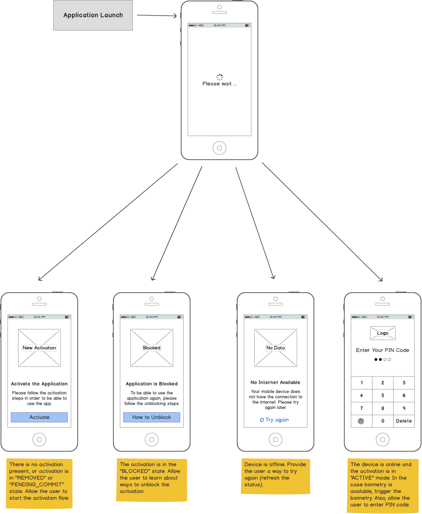
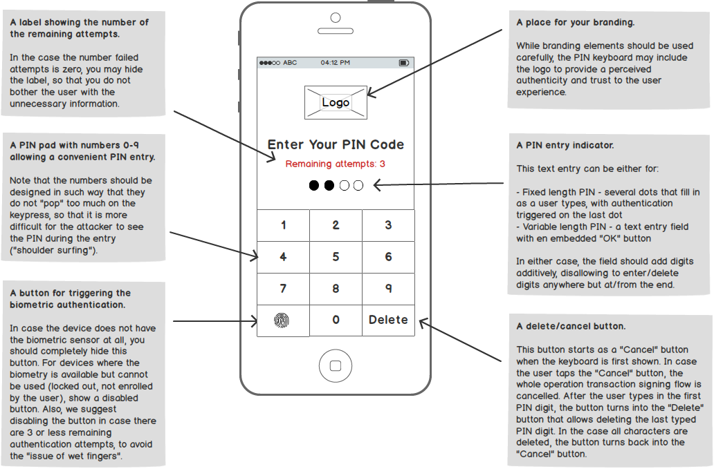
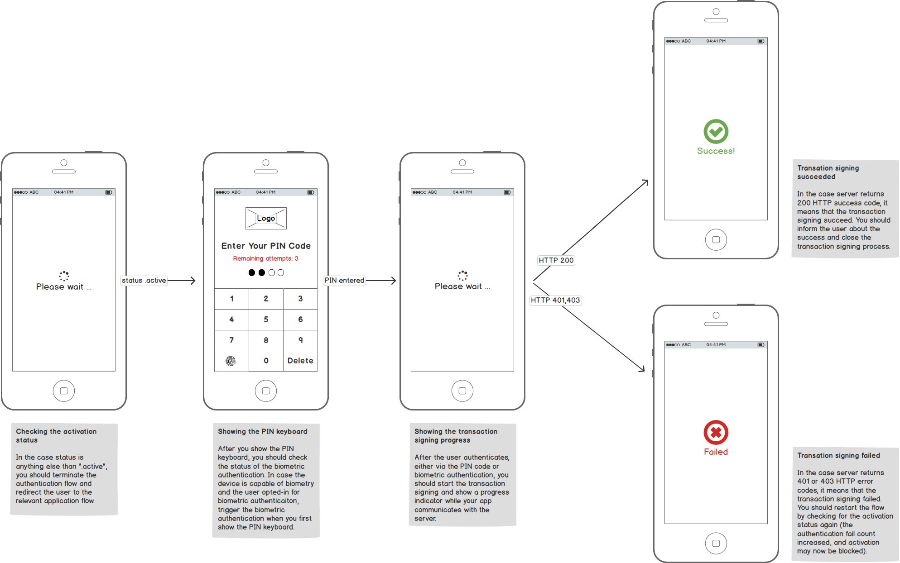

# Implementing Authentication in Mobile Banking Apps (SCA) on iOS Platform

<!-- AUTHOR joshis_tweets 2020-05-04T00:00:00Z -->
<!-- SIDEBAR _Sidebar_iOS.md sticky -->

In this tutorial, we will show you how to implement authentication into your mobile banking or fintech app on iOS.

This tutorial has four parts:

- [Mobile Authentication Overview](Readme.md)
- [Tutorial for Server Side Developers](Server-Side-Tutorial.md)
- **Tutorial for iOS Developers**
- [Tutorial for Android Developers](Android-Tutorial.md)

## Prerequisites

This tutorial assumes, that you have:

- Read and understood the [Mobile Authentication Overview](Readme.md)
- [Required back-end infrastructure up and running](Server-Side-Tutorial.md).
- Xcode 11.4+ with the Developer Tools installed

## Introduction

When implementing the authentication flow on mobile, your task consists of building two major use-cases outlined in the [introductory overview documentation](Readme.md):

- Device activation
- Transaction signing

Of course, you will need to also implement several auxiliary use-cases but these will become simple once you have device activation and transaction signing use-cases in place.

Our [Mobile Security Suite SDK](https://wultra.com/mobile-security-suite) will help you with the above-mentioned use-cases. Since the underlying authentication protocol is called PowerAuth, the Mobile Security Suite SDK technical components inherit this naming. The "Mobile Security Suite SDK" is called the **PowerAuth SDK** on the technical level.

During the device activation flow, the SDK communicates with the public enrollment services. During the transaction signing, the SDK communicates with your server that publishes some protected resources (login, payment approval). The mobile app never communicates with the PowerAuth Server interface since this component is hidden deep in the secure infrastructure. See the component description in the [introductory overview documentation](Readme.md).

## Getting the SDK

The easiest way to install the PowerAuth SDK into your project is using [Cocoapods](https://cocoapods.org/), by editing your Podfile:



```rb
platform :ios, '8.0'
target '<Your Target App>' do
  pod 'PowerAuth2'
end

# Disable bitcode for iOS targets
post_install do |installer|
  installer.pods_project.targets.each do |target|
    if target.platform_name == :ios
      puts "Disabling bitcode for target  #{target.name}"
      target.build_configurations.each do |config|
        config.build_settings['ENABLE_BITCODE'] = 'NO'
      end
    end
  end
end
```



_Note: You need to disable bitcode for PowerAuth SDK to work._

After you made the necessary changes in the Podfile, you can run the install command:



```sh
$ pod install
```



Finally, you can import PowerAuth SDK in any file where you need it:



```swift
import PowerAuth2
```



## Configuration

To configure your `PowerAuthSDK` instance, you need the following values from the PowerAuth Server:

- `APP_KEY` - Application key that binds an activation with a specific application.
- `APP_SECRET` - Application secret that binds an activation with a specific application.
- `KEY_MASTER_SERVER_PUBLIC` - Master Server Public Key used for non-personalized encryption and server signature verification.
- `BASE_ENDPOINT_URL` - The location of your [PowerAuth Standard RESTful API](https://github.com/wultra/powerauth-crypto/blob/develop/docs/Standard-RESTful-API.md) endpoints. The path should contain everything that goes before the `/pa/**` prefix of the API endpoints.

All these values should be provided to you by your [server-side team](Server-Side-Tutorial.md) who configured the back-end infrastructure.

Use the provided values to configure the `PowerAuthSDK` instance:



```swift
func application(_ application: UIApplication, didFinishLaunchingWithOptions launchOptions: [UIApplicationLaunchOptionsKey: Any]?) -> Bool {

    // Prepare the configuration
    let configuration = PowerAuthConfiguration()
    configuration.instanceId = Bundle.main.bundleIdentifier ?? ""
    configuration.appKey = "sbG8gd...MTIzNA=="
    configuration.appSecret = "aGVsbG...MTIzNA=="
    configuration.masterServerPublicKey = "MTIzNDU2Nz...jc4OTAxMg=="
    configuration.baseEndpointUrl = "https://localhost:8080/demo-server"

    // Configure default PowerAuthSDK instance
    PowerAuthSDK.initSharedInstance(configuration)

    return true
}
```



_Note: In case you use a development infrastructure with self-signed certificates, make sure to set `PA2ClientSslNoValidationStrategy` to the shared SDK instance and check the transport security configuration in your `Info.plist` file._

## Checking the Activation Status

After a user launches an application, you need to determine which user interface to show. Should you display a login UI? Or a new activation flow? Or an information that the device is blocked or removed?

Luckily, we have a simple method calls to obtain a detailed activation status:



```swift
// Check if there is some activation data on the device
if PowerAuthSDK.sharedInstance().hasValidActivation() {
    // If there is an activation on the device, check the status with server
    PowerAuthSDK.sharedInstance().fetchActivationStatus() { (status, customObject, error) in
        // If no error occurred, process the status
        if error == nil {
            // Show the UI relevant to the activation status.
            self.presentUi(with: status)
        } else {
            // Network error occurred, report it to the user.
            self.presentNetworkError()
        }
    }
} else {
    // No activation is present on device.
    // Show the UI for a new activation.
    self.presentNewActivationUi()
}
```



##### Mockups

Here is an example mockup of the screens that need to be implemented:



## New Activation

In the case no usable activation is available on the iOS device, you can guide the user through the steps to create it. Each activation has two major flows on the mobile device:

- **Creating the Activation** - Exchanging the user's identity proof with the server for the cryptographic activation data.
- **Committing the Activation** - Storing the cryptographic activation data on the device using the user's local credentials. _Note: Thanks to this step, the user credentials, such as PIN code or biometric information, never leave the mobile device and are only used locally, to obtain cryptographic data required during the transaction signing._

### Creating the Activation

In the first step of a new activation process, you need to exchange the user's proof of identity for the cryptographic activation data. There are several ways to accomplish this.

#### Using Activation Code

The easiest way to create an activation is using the PowerAuth activation code that you will obtain from the back-end part (for example, via a QR code shown in the Internet banking):



```swift
// Create the activation with an activation code
let deviceName = UIDevice.current.name
let activationCode = "VVVVV-VVVVV-VVVVV-VTFVA"

// Create activation object with given activation code.
guard let activation = PowerAuthActivation(activationCode: activationCode, name: deviceName) else {
    // Activation code is invalid
}

// Create a new activation with just created activation object
PowerAuthSDK.sharedInstance().createActivation(activation) { (result, error) in
    if error == nil {
        // No error occurred, proceed to credentials entry (PIN prompt, Enable Touch ID switch, ...) and commit
    } else {
        // An error occurred, report it to the user
    }
}
```



_Note: You can let the user scan the activation code from a QR code, to make the process faster and improve the user convenience, but you should also allow the manual entry as a backup._

##### Mockups

Here is an example mockup of the screens that need to be implemented:


#### Using Custom Credentials

Alternatively, you can use some other credentials your server supports to create a new activation. You always need to spend some thought about which credentials you should use. You do not want to use credentials that are too weak. **The authentication proof resulting from transaction signing is only as strong as the credentials that were used during the activation flow.**

However, once you have the credentials that are sufficiently strong, you can create an activation easily:



```swift
// Create a new activation with given device name and custom login credentials
let deviceName = UIDevice.current.name
let credentials = [
    "username": "john.doe@example.com",
    "password": "YBzBEM",
    "otp": "072471"
]

// Create activation object with given credentials.
guard let activation = PowerAuthActivation(identityAttributes: credentials, name: deviceName) else {
    // Activation credentials are empty
}

// Create a new activation with just created activation object
PowerAuthSDK.sharedInstance().createActivation(activation) { (result, error) in
    if error == nil {
        // No error occurred, proceed to credentials entry (PIN prompt, Enable Touch ID switch, ...) and commit
    } else {
        // Error occurred, report it to the user
    }
}
```



In the example, we used a combination of the username, password and an OTP generated elsewhere (for example, via a HW token, or delivered via SMS). But any credentials that you determined are suitable for activation will work.

##### Mockups

Here is an example mockup of the screens that need to be implemented:


### Committing the Activation

After you successfully perform the steps for creating the activation, you can prompt the user to enter the new local PIN code / password and allow an opt-in for the biometric authentication (of course, [only in the case the device supports biometry](https://github.com/wultra/powerauth-mobile-sdk/blob/develop/docs/PowerAuth-SDK-for-iOS.md#biometry-setup)).

You can now commit the newly created activation with the requested authentication factors:



```swift
do {
    let auth = PowerAuthAuthentication()
    auth.usePossession = true
    auth.usePassword   = "1234" // user's PIN code
    auth.useBiometry   = true

    try PowerAuthSDK.sharedInstance().commitActivation(with: auth)
} catch _ {
    // happens only in case SDK was not configured or
    // when activation is not in the correct state to be committed
}
```



In most cases, the `usePossession` is set to `true` and `usePassword` to the value of the PIN or password user selected. The `useBiometry` value should be set to `true` in the case user decided to opt-in for biometric authentication, and to `false` otherwise.

## Transaction Signing

In case you successfully activated the device, you can use the new activation for transaction signing. This is achieved by signing the full request data. In case of the HTTP request with a body (`POST`, `PUT`, `DELETE`), the HTTP request body is used. In case of the `GET` request, the SDK builds canonical data from the URL query parameters.

The transaction signing requires an absolute precision. Every single bit makes a huge difference just one step further in the process. Be patient and do not worry if transaction signing doesn't work the first time you try. In case you are having issues, do not hesitate to ask our engineers for help.

### User Experience Perspective

To make the user experience consistent, we recommend making a solid UI abstraction on top of the transaction signing logic. This usually means implementing the transaction signing logic inside a **unified PIN keyboard**. Such keyboard would then handle the typical use-cases people expect to see when working with PIN keyboards, such as:

- Entering a PIN code for the purpose of transaction signing.
- Allowing to use biometry as a faster alternative to the PIN code.
- Checking the number of remaining authentication attempts.
- Showing the transaction signing progress.
- Error reporting, invalid activation status handling, etc.

The following picture shows an anatomy of a well-designed PIN keyboard:



Another thing to consider is the high-level user flow. The overview of the flow stages is captured in the following diagram:



You can read more information about the authentication flow in the chapters below.

### Configuring the Unified PIN Keyboard

To cover the typical use-cases efficiently, the unified PIN keyboard should be configurable with at least the following attributes:

- **The URI Address** - Basically the service location that will be called while sending the signed request using an HTTP client of your choice. We use `uri` variable in the example.
- **The URI ID** - Identifier of the URI / service. **Be very careful here!** In the examples below, we use a value of `uriId` for this value. While it is remarkably similar to the end of an actual URI (`uri`), this value is in fact an arbitrarily chosen constant that the client and server must agree on beforehand for a particular server-side operation represented. You need to ask your server developer for the exact value.
- **The HTTP request data** - This is basically the data that will be signed. For the `POST` requests (that are the most common in the case of transaction signing), this value represents simply the HTTP request body bytes.
- **The HTTP method** - (Optional) The HTTP method to be used for the call. For the most cases, the calls should be made via the `POST` value and hence the `POST` value should be the default.
- **The HTTP headers** - (Optional) Value of any other HTTP headers you need to use when calling your service.

### Checking the Activation Status

We covered a similar use-case earlier in the context of the new activation flow. However, you should also check for the activation status before every attempt to use the transaction signing since the activation might have been blocked or removed on the server side.

In case you check the activation status and the result is anything else than `.active`, you should cancel the transaction signing flow and redirect the user to the appropriate alternate flow, such as a new activation wizard, unblocking tutorial, etc.

For the `.active` status, you should check if the number of failed attempts is greater than zero and show the UI for the number of remaining attempts in such case. The outline of the logic is the following:



```swift
// Check if there is some activation data on the device
if PowerAuthSDK.sharedInstance().hasValidActivation() {
    // If there is an activation on the device, check the status with server
    PowerAuthSDK.sharedInstance().fetchActivationStatus() { (status, customObject, error) in
        // If no error occurred, process the status
        if error == nil {
            if status.state == .active {
                if status.failCount > 0 {
                    self.remainingLabel.isHidden = false
                    self.remainingLabel.text = "Remaining attempts: " + status.remainingAttempts
                } else {
                    self.remainingLabel.isHidden = true
                }
                // ... see determining the biometry status
            } else {
                // Show the UI relevant to the activation status.
                self.presentUi(with: status)
            }
        } else {
            // Network error occurred, report it to the user.
            self.presentNetworkError()
        }
    }
} else {
    // No activation is present on device.
    // Show the UI for a new activation.
    self.presentNewActivationUi()
}
```



### Determining the Biometry Status

In case the biometry is present and allowed by the user, you should trigger transaction signing using the biometry right away when the unified PIN keyboard is first shown.

To check the status of the biometry, you can use the following logic:



```swift
if PA2Keychain.canUseBiometricAuthentication && status.remainingAttempts > 2 && self.autoTriggerBiometry {
    self.biometryButton.enabled = true
    self.signWithBiometry()
} else {
    // Let user enter PIN code
    self.biometryButton.enabled = false
}
self.autoTriggerBiometry = false
```



Note that decided to not only check for the mere availability of the biometry, but we also check for the remaining attempt count to make sure the user is not blocked in case of "wet fingers". Also, you can notice the property `autoTriggerBiometry` that we use to automatically launch the biometry only the first time a unified PIN keyboard is opened. For 2nd and further authentication attempts, we want the user to trigger the biometric authentication manually.

### Request Signing

To sign the request data, you first need to prepare a `PowerAuthAuthentication` instance that specifies the authentication factors that you want to use. After that, you can compute the HTTP header with the signature and send the request to the server.



```swift
// Transaction signing with a biometry
func signWithBiometry() -> URLSessionDataTask? {
    let auth = PowerAuthAuthentication()
    auth.usePossession = true
    auth.useBiometry   = true
    return signWith(authentication: auth)
}

// Transaction signing with a password or a PIN code
func signWith(password: String) -> URLSessionDataTask? {
    let auth = PowerAuthAuthentication()
    auth.usePossession = true
    auth.usePassword   = password
    return signWith(authentication: auth)
}

// Transaction signing with an authentication object
func signWith(authentication: PowerAuthAuthentication) -> URLSessionDataTask? {
    do {
        // Get the request attributes
        let uri    = self.uri    // "https://my.server.example.com/payment"
        let uriId  = self.uriId  // "/payment"
        let method = self.method // "POST"
        let body   = self.body   // the serialized bytes of HTTP request body

        // Compute the signature header
        let signature = try PowerAuthSDK.sharedInstance().requestSignature(with: auth, method: method, uriId: uriId, body: body)
        let header = [ signature.key: signature.value ]

        // Send an HTTP request with the HTTP header computed above.
        // Note that we are sending the POST call to the service URI, with
        // a computed signature HTTP header and the request body bytes
        return self.httpClient.post(uri, header, body)
    } catch _ {
        // In case of invalid configuration, invalid activation
        // state or corrupted state data
        return nil
    }
}
```



You can hook the `signWithBiometry` method to the button for the biometric authentication and the `signWith(password:)` method to the PIN keyboard (for example, to be triggered when a sufficiently long PIN code is entered by the user).

Note that the method in our example returns an `URLSessionDataTask` instance (of course, this could be any networking abstraction you use in your project), or a `nil` value in case there is an invalid state. In case the `URLSessionDataTask` is launched, you should wait for it to complete (showing the progress indicator to the user) and check the response HTTP status:

- In case the HTTP status is `401` or `403`, it means that the transaction signing failed and in such case, you can simply restart the loop of checking the activation status, displaying the failure count, etc.
- In case the HTTP status is `200`, it means that the transaction signing was successful. You can retrieve any data that you need from the response and close the PIN keyboard (ideally, with some nice "victory animation").


## Resources

You can find more details about the iOS SDK in our reference documentation:

- [Mobile SDK for iOS and Android Documentation](https://github.com/wultra/powerauth-mobile-sdk)

## Continue Reading

Proceed with one of the following chapters:

- [Mobile Authentication Overview](Readme.md)
- [Tutorial for Server Side Developers](Server-Side-Tutorial.md)
- [Tutorial for Android Developers](Android-Tutorial.md)
