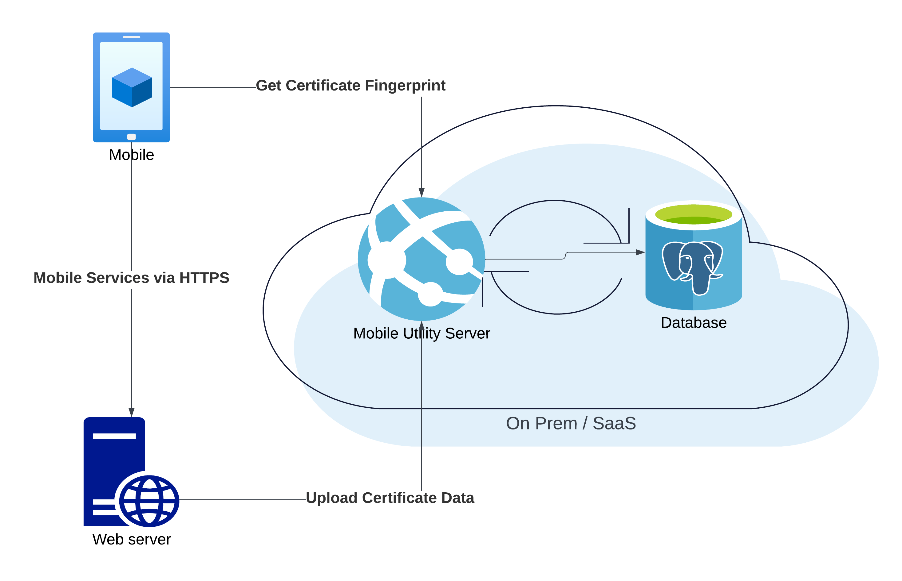

# Dynamic TLS/SSL Certificate Pinning

<!-- AUTHOR joshis_tweets 2023-05-23T00:00:00Z -->
<!-- SIDEBAR _Sidebar.md sticky -->
<!-- TEMPLATE tutorial -->
<!-- COVER_IMAGE cover.webp -->

To ensure secure communication between the mobile app and the web server, authentication of the server is a crucial part. Otherwise, an attacker could execute a man-in-the-middle attack (MITM) and pose as a legitimate server.

TLS/SSL Certificate Pinning prevents this type of attack. It involves explicitly checking the server certificate needed to establish a secure connection. To do this, the mobile app must know which certificate it can trust.

Since certificates are renewed on a yearly basis (at most) and it would be impractical to issue new versions of the mobile app with every certificate renewal, so-called dynamic TLS/SSL certificate pinning is a suitable approach. This creates a secure channel using base cryptographic methods to update information about the newly issued certificate (certificate fingerprints).

## Solution Components

Dynamic TLS/SSL certificate pinning by [Wultra](https://wultra.com) uses two components:

- The Wultra Dynamic SSL Pinning library (SDK) on the mobile device.
- The Mobile Utility Server.

The components are displayed on the following image:

## Security Principle

The security of the channel for secure fingerprint exchange is based on asymmetric signing. The [Mobile Utility Server](https://github.com/wultra/mobile-utility-server) signs the certificate fingerprints of the registered domains with a private key. The library in the mobile app downloads the list of fingerprints and verifies authenticity using the public key.

During the connection from the mobile app to the registered domain, the mobile SDK can be used to verify that the server certificate is among the trusted ones. When a new certificate is issued to the web server, an update of the list in the [Mobile Utility Server](https://github.com/wultra/mobile-utility-server) is required and the mobile application updates the list on the client device using the library.

## Resources

You can find more details in the following documentation:

- [Dynamic SSL Pinning SDK for iOS](https://github.com/wultra/ssl-pinning-ios)
- [Dynamic SSL Pinning SDK for Android](https://github.com/wultra/ssl-pinning-android)
- [Mobile Utility Server](https://github.com/wultra/mobile-utility-server)

## Continue Reading

Proceed with one of the following chapters:

- [Dynamic SSL Pinning Overview](./Readme.md)
- [Dynamic SSL Pinning on iOS](./iOS-Tutorial.md)
- [Dynamic SSL Pinning on Android](./Android-Tutorial.md)
- [Dynamic SSL Pinning Server](./Server-Side-Tutorial.md)
