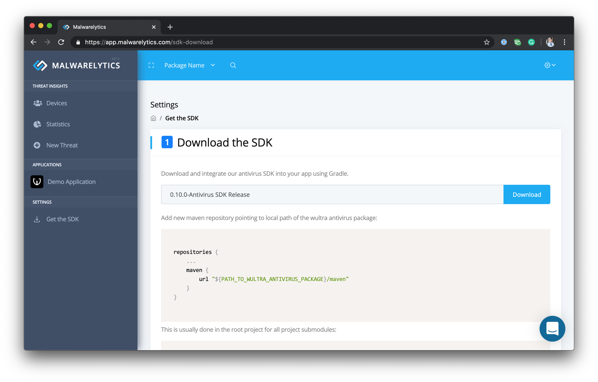
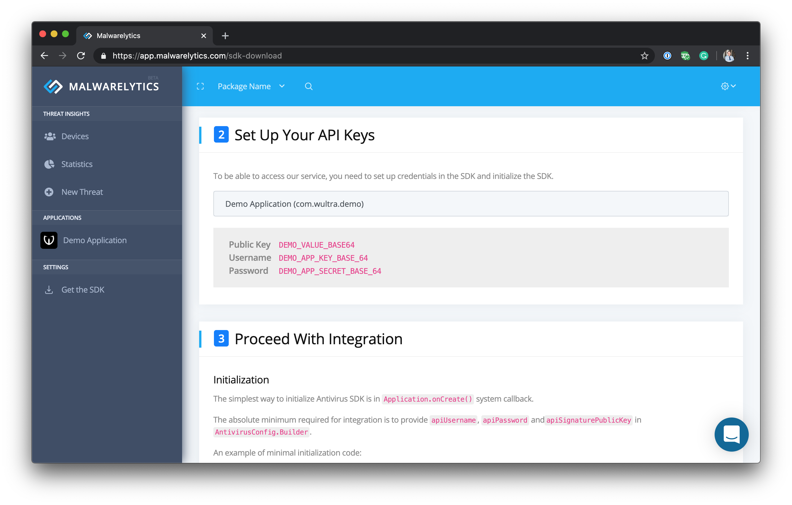
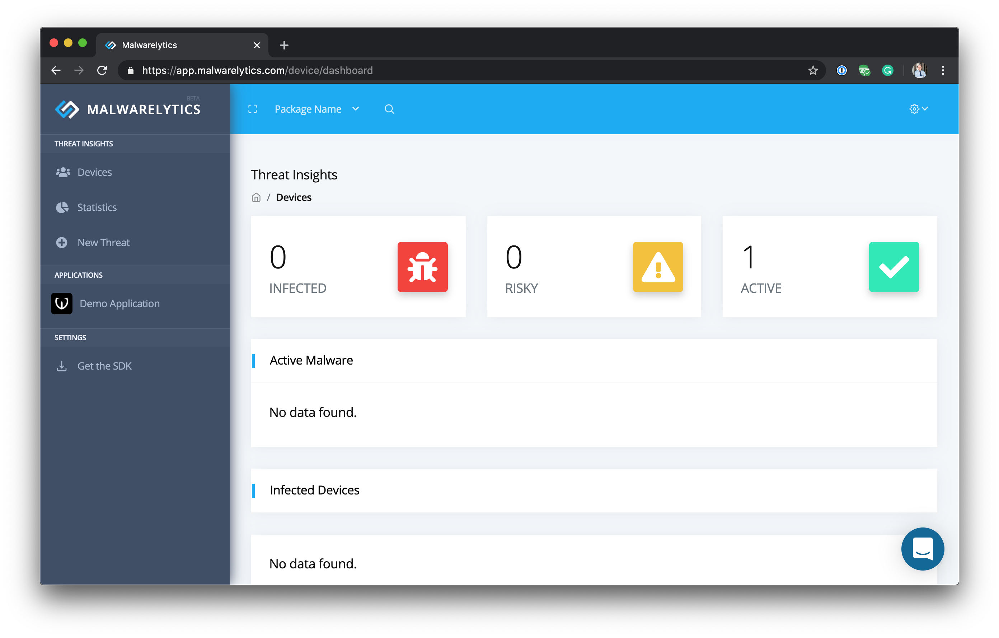

# Getting Started with Malwarelytics

<!-- AUTHOR joshis_tweets 2020-05-04T00:00:00Z -->
<!-- SIDEBAR _Sidebar.md sticky -->

Mobile malware is a quickly growing phenomenon. More and more banks worldwide are targeted by malware such as Anubis, Cerberos, or Event Bot, and financial institutions should provide a remedy to this issue.

This tutorial explains how you can integrate Malwarelytics - a malware protection plugin - into your Android app.

## Register at Malwarelytics

First, you need to create your Malwarelytics account. Simply [visit the Malwarelytics sign up page](https://www.wultra.com/malwarelytics-signup) and fill in your details.

After you sign up, we will verify your account before we provide you with the access to the service. The verification is required - we do not need the cybercriminals examining our systems. During the account verification process, we will also set up your applications package names for production and development environments.

After the we finish the configuration and approve your account, you can log in to an empty Malwarelytics console.


## Get the Malwarelytics SDK

You can download the Malwarelytics SDK by clicking the **Get the SDK** item in the left navigation. In the **Download the SDK** section, click the **Download** button to download the latest version.



Once you download the SDK archive, extract it and place it to a desired location on your file system. After that, add a new repository to the Android root project:

```rb
allproject {
  repositories {
    maven {
      url "${PATH_TO_MALWARELYTICS}/maven"
    }
  }
}
```

Then you can simply import the dependency in your Android project:

```rb
android {
  dependencies {
    implementation "com.wultra.android.antimalware:antivirus:${MALWARELYTICS_VERSION}"
  }
}
```

## Obtain API Keys

You can easily obtain the Malwarelytics API keys in the Malwarelytics console, in the **Get the SDK** section. Simply scroll the page until you see the **Set Up Your API Keys** heading, and select the application for which you need to obtain the keys.



## Integrate the SDK

To integrate the SDK in your app, insert the following code snippet to your `Application.onCreate()` method:

```kotlin
class MyApplication : Application() {

  override fun onCreate() {
    // Use your API keys in configuration
    val config = AntivirusConfig.Builder(appContext)
                   .apiUsername(API_USERNAME)
                   .apiPassword(API_PASSWORD)
                   .apiSignaturePublicKey(API_SIGNATURE_PUBLIC_KEY)
                   .build()

    // Obtain and initialize the Malwarelytics SDK instance
    val antivirus = Antivirus.getInstance()          
    antivirus.initializeAsync(config, object: Antivirus.InitializationObserver {
      override fun onInitialized() {
        // Malwarelytics is initialized and ready to be used

        // Set internal user ID if it is available
        antivirus.updateClientAppUserId(INTERNAL_USER_ID)
      }
    })
  }

}
```

**Do not forget to set your internal user ID. Otherwise, it will be difficult to identify which users devices are infected with malware later. In the ideal situation, you can use an opaque random device identifier as the `INTERNAL_USER_ID`. However, any identifier that you can use to look up the infected device or the user will do the trick.**

After you compile and launch the Android application, Malwarelytics scan automatically starts and it sends the first impulse from your active device to the Malwarelytics service.



## Customize the UI Appearance

By default, the Malwarelytics SDK works in a silent mode. It only evaluates threats and sends them to the Malwarelytics service.

In the case you would like to inform the end-user about a problematic app right on the device, the easiest way to do this is to use our built-in user interface components:

```kotlin
val threatMitigationUIConfig = ThreatMitigationUIConfig.Builder()
  .notificationChannelId(ChannelIdString)
  .notificationSmallIcon(IconResInt)
  .screenBackgroundColor(ColorResInt)
  .screenButtonBackgroundColor(ColorResInt)
  .screenButtonTextColor(ColorResInt)
  .screenDeleteIconColor(ColorResInt)
  .screenSeparatorColor(ColorResInt)
  .screenTextColor(ColorResInt)
  .build()

val config = AntivirusConfig.Builder(appContext)
    // ...
    .setThreatMitigationUIConfig(threatMitigationUIConfig)
    .build()
```

By providing the UI configuration, Malwarelytics SDK automatically presents the appropriate UI components whenever needed, using your application as the vessel.

## Summary

We just integrated the Malwarelytics SDK into your Android app and sent the first data sample to the Malwarelytics service. After you launch your app to the public, your Malwarelytics console will start to fill up with useful data about active malware and infected devices.
