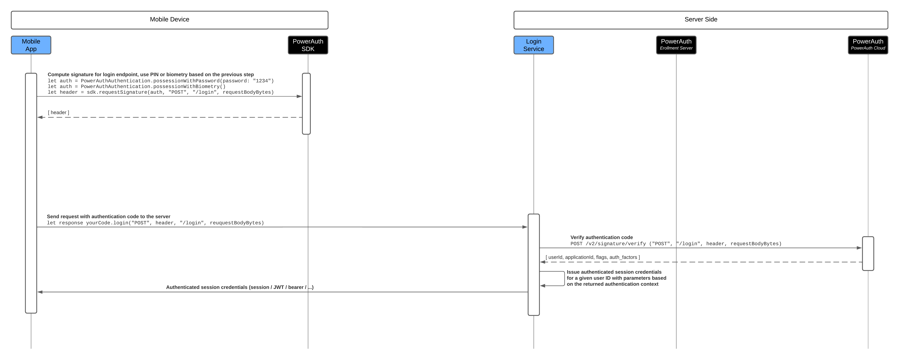
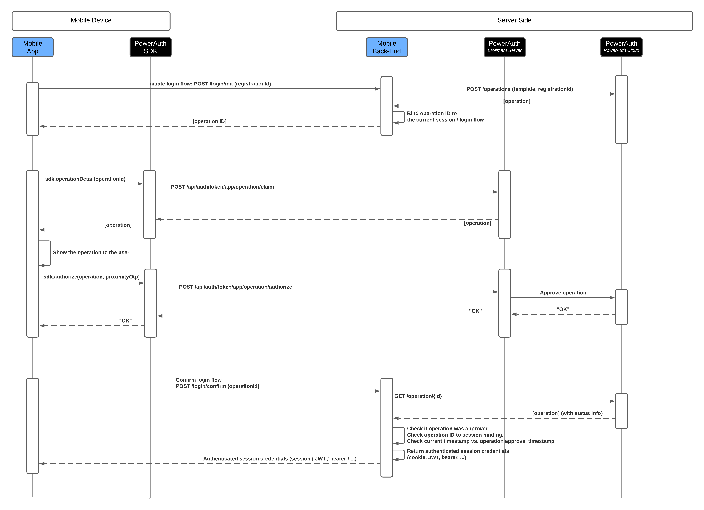

# Implement Login in Mobile Apps

<!-- AUTHOR joshis_tweets 2025-10-26T00:00:00Z -->
<!-- SIDEBAR _Sidebar.md sticky -->
<!-- TEMPLATE tutorial -->
<!-- COVER_IMAGE cover.jpg -->

Login in mobile application is the most essential use-case for the mobile-first authentication. This article covers three main approaches to implementing it, focusing on the initial authentication part that establishes the "session".

The article does not cover specifics of subsequent session management. The approaches to managing such sessions may differ among applications. For example, some apps will be perfectly fine with just a standard HTTP session based on cookie, while other will prefer either JWTs or opaque tokens, for a more stateless approach.

**In the article, we will refer to the above approaches to managing session as "authenticated session credentials".**

## Prerequisites

This article assumes that you are familiar with the PowerAuth protocol, mobile-first authentication concepts, and mainly, that you know how to:

- Install and configure back-end components
- Integrate PowerAuth Mobile SDK and Mobile Token SDK on iOS and Android
- Create a new device registration and check the registration status
- Check the availability of the biometrics
- Initiate transaction signing using various authentication factors

As a result, steps related to the above areas are skipped from the article for the sake of brevity.

## Authentication Codes for HTTP Requests

<!-- begin box success -->
**When to use:** When implementing login in mobile app only, when flow simplicity is an important factor, or when login speed may be negatively impacted by poor network connection on mobile device.
<!-- end -->

The original and the most straight forward way to implement login in a mobile app is using authentication code for HTTP request sent to the custom login endpoint.

The process works in the following steps:

1. Mobile app uses PowerAuth Mobile SDK to compute authorization header for the HTTP call to custom login endpoint `/login`.
2. Custom login endpoint receives the authorization header and validates the request against our Authentication Code API.
3. If the validation succeeds, the login endpoint issues authenticated session credentials.

The app and server must agree on used HTTP method (`POST`) and a resource identifier (i.e., `/login`), which is by convention derived from the URL (the significant part of the context path).

### Computing Authentication Code

In the mobile app, all you need to do is to compute the authorization HTTP header `X-PowerAuth-Authorization`:

<!-- begin tabs -->
<!-- tab Swift -->
```swift
// Authenticate with biometrics
func signWithBiometry() -> URLSessionDataTask? {
    let auth = PowerAuthAuthentication.possessionWithBiometry()
    return signWith(authentication: auth)
}

// Authenticate with a password or a PIN code
func signWith(password: String) -> URLSessionDataTask? {
    let auth = PowerAuthAuthentication.possessionWithPassword(password: PowerAuthCorePassword(password: password))
    return signWith(authentication: auth)
}

// Authenticate with an authentication object
func signWith(authentication: PowerAuthAuthentication) -> URLSessionDataTask? {
    do {
        // Get the request attributes
        let uri    = self.uri    // "https://my.server.example.com/login"
        let uriId  = self.uriId  // "/login"
        let method = self.method // "POST"
        let body   = self.body   // the serialized bytes of the HTTP request body

        // Compute the signature header
        let signature = try powerAuth.requestSignature(with: auth, method: method, uriId: uriId, body: body)
        let header = [ signature.key: signature.value ]

        // Send an HTTP request with the HTTP header computed above.
        // Note that we are sending the POST call to the service URI, with
        // a computed signature HTTP header and the request body bytes
        return self.httpClient.post(uri, header, body)
    } catch _ {
        // In case of invalid configuration, invalid activation
        // state or corrupted state data
        return nil
    }
}
```
<!-- tab Kotlin -->
```kotlin
// Authenticate with biometrics
fun signWithBiometry(listener: IMyAuthListener) {
    // Authenticate user with biometry and obtain encrypted biometry factor-related key.
    powerAuthSDK.authenticateUsingBiometrics(context, fragmentManager, "Sign in", "Use the biometric sensor on your device to continue", object: IAuthenticateWithBiometricsListener {
        override fun onBiometricDialogCancelled(userCancel: Boolean) {
            // User cancelled the operation
            listener.authenticationCancelled();
        }

        override fun onBiometricDialogSuccess(authentication: PowerAuthAuthentication) {
            signWithAuthentication(auth, listener);
        }

        override fun onBiometricDialogFailed(error: PowerAuthErrorException) {
            listener.authenticationFailed(error);
        }
    })
}

// Authenticate with a password or a PIN code
fun signWithPassword(password: Password, listener: IMyAuthListener) {
    val  authentication = PowerAuthAuthentication.possessionWithPassword(password)
    signWithAuthentication(auth, listener)
}

// Authenticate with an authentication object
fun signWithAuthentication(auth: PowerAuthAuthentication, listener: IMyAuthListener) {
    // Get the request attributes
    val uri    = this.uri    // "https://my.server.example.com/login"
    val uriId  = this.uriId  // "/login"
    val method = this.method // "POST"
    val body   = this.body   // the serialized bytes of HTTP request body

    // Compute the signature header
    val header = powerAuthSDK.requestSignatureWithAuthentication(context, auth, method, uriId, body)
    if (!header.isValid) {
        listener.authenticationFailed(Reason.CRYPTO);
        return
    }
    val header = HttpHeader(header.key, header.value)

    // Send an HTTP request with the HTTP header computed above.
    // Note that we are sending the POST call to the service URI, with
    // a computed signature HTTP header and the request body bytes
    this.httpClient.post(uri, header, body, object: IMyHttpClientListener {
        fun networkSuccess(statusCode: Int, headers: List<Header>, responseBody: ByteArray) {
            if (statusCode == 200) {
                listener.authenticationSuccess(headers, responseBody)
            } else if (statusCode == 401 || statusCode == 403) {
                listener.authenticationFailed(Reason.UNAUTHORIZED)
            } else {
                listener.authenticationFailed(Reason.OTHER)
            }
        }

        fun networkFailed() {
            // Networking failed
            listener.authenticationFailed(Reason.NETWORKING)
        }
    })
}
```
<!-- end -->

### Verifying Authentication Code on the Server

On the server side, you need to extract the `X-PowerAuth-Authorization` HTTP header from the request, and obtain a raw (unmodified!) HTTP request body and encode it as Base64. This steps can be tricky, as the raw request body data is often hidden behind a framework.

<!-- begin box warning -->
You must obtain request body data exactly as it was constructed on the mobile, bit-by-bit. Any modification, such as removing whitespaces or reordering JSON attributes will result in failed authentication code validation, because the data won't match the proof provided in the header.
<!-- end -->

Then, you can easily verify the signature:

- Method: `POST`
- Endpoint URL: `/v2/authentication/verify` (formerly `/v2/signature/verify`)

```json
{
  "method": "POST",
  "uriId": "/login",
  "authHeader": "PowerAuth pa_activation_id=\"7a24c6e9-48e9-43c2-ab4a-aed6270e924d\", pa_application_key=\"Z19gyYaW5kb521fYWN0aXZ==\", pa_nonce=\"kYjzVBB8Y0ZFabxSWbWovY==\", pa_signature_type=\"possession_knowledge\", pa_signature=\"MDEyMzQ1Njc4OWFiY2RlZjAxMjM0NTY3ODlhYmNkZWY=\", pa_version=\"3.1\"",
  "requestBody": "e30="
}
```

On successful verification, the call will return information about the login context:

```json
{
  "signatureValid": true,
  "userId": "user1234",
  "registrationId": "7a24c6e9-48e9-43c2-ab4a-aed6270e924d",
  "registrationStatus": "ACTIVE",
  "signatureType": "possession_knowledge",
  "remainingAttempts": 5,
  "flags": [
    "READONLY"
  ],
  "application": {
    "id": "my-app",
    "roles": [
      "BANKING",
      "TOKEN"
    ]
  }
}
```

Based on the context, you can either establish an authenticated HTTP session, or return a token for subsequent access (JWT, opaque token).

### Sequence Diagram



### Pros and Cons

#### Pros

- Only one HTTP call is required
- The process is simple to implement
- High security of the flow

#### Cons

- Obtaining raw request data may be cumbersome in some server-side frameworks
- Different workflow and auditing trail than for out-of-band logins on the web

## Device-Bound Operations

<!-- begin box success -->
**When to use:** When implementing login in both mobile app and on the web, when prioritizing auditing clarity (same process for mobile and web), or when working with HTTP requests directly would be too complicated.
<!-- end -->

Using device-bound operations for login in a mobile app has several advantages. It removes the need to work with raw HTTP requests in both mobile app and on the server. Also, the audit trail and processess are much more unified when authenticating both in mobile app and on the web. While the process requires more HTTP calls (making it more error prone in case of a bad network connection), the calls are generally simpler.

Your server must publish at least two endpoints:

- `POST /login/init` - creates the login operation
- `POST /login/confirm` - completes the login flow and returns the session, JWT or token

The process works in the following steps:

1. The mobile app initiates the login by creating a device-bound operation by calling the `POST /login/init` endpoint.
2. The mobile app approves the operation using the Mobile Token SDK methods.
3. The mobile app confirms the login by asking the server to check the operation was really correctly approved.

### Mandatory Checks

<!-- begin box warning -->
**The steps below are mandatory.** Skipping them makes the authentication flow vulnerable.
<!-- end -->

#### Session-Bound, One-Time Use of Operations

When using operations, you must ensure that an operation with given ID is only used once for creating a particular authenticated session. You can ideally do this by binding the operation ID with the current session ID, or - if you use fully stateless approach - at least by keeping track of operation IDs that were already used for authentication and issuing an access token.

This check prevents using a single operation to authenticate two separate login flows in different sessions.

#### Ensuring Recent Approval

When checking the operation status and learning that the operation was approved, you must additionally check that the operation was approved reasonably recently, i.e., in the past one minute, by comparing the `timestampFinalized` with the current timestamp.

This check prevents stacking pre-authenticated operations on the server and confirming them later, with a significant time delays.

### Initiating the Login Flow

In the first step, the mobile app must contact your server endpoint `POST /login/init` to obtain the operation associated with the current login process, passing it registration ID.

To obtain the registration ID, use the following SDK method:

<!-- begin tabs -->
<!-- tab Swift -->
```swift
let registrationId = powerAuthSDK.activationIdentifier
```
<!-- tab Kotlin -->
```kotlin
val registrationId = powerAuthSDK.getActivationIdentifier()
```
<!-- end -->

Then, call the server with the activation ID value, like so:

- Method: `POST`
- Endpoint URL: `/login/init`

```json
{
    "registrationId": "7a24c6e9-48e9-43c2-ab4a-aed6270e924d"
}
```

The `/login/init` endpoint internally calls our Operations API to create an operation bound to the provided registration ID:

- Method: `POST`
- Endpoint URL: `/v2/operations`

```json
{
    "template": "login",
    "registrationId": "7a24c6e9-48e9-43c2-ab4a-aed6270e924d"
}
```

This call to our `/v2/operations` endpoint returns the operation details:

```json
{
  "operationId": "aed6c6e9-48e9-43c2-ab4a-7a24270e924d",
  "userId": "user123",
  "status": "PENDING",
  "template": "login",
  "operationType": "login",
  "failureCount": 0,
  "maxFailureCount": 5,
  "timestampCreated": 123456789,
  "timestampExpires": 123466789,
  "registrationId": "7a24c6e9-48e9-43c2-ab4a-aed6270e924d"
}
```

The `/login/init` endpoint should now bind the operation ID with the current session, or at least mark the operation ID as one which is now in use. It can then return just the operation ID back to the mobile app:

```json
{
    "operationId": "aed6c6e9-48e9-43c2-ab4a-7a24270e924d"
}
```

### Approving the Operation

Once you receive the operation ID back in your mobile app, you can leverage Mobile Token SDK methods to obtain operation detail and approve it.

To get the operation detail, use the following code:

<!-- begin tabs -->
<!-- tab Swift -->
```swift
// Retrieve operation details based on the operation ID.
func getDetail(operationId: String) {
    operationService.getDetail(operationId: operationId) { result in
        switch result {
        case .success(let operation):
            // process operation
            break
        case .failure(let error):
            // process error
            break
        }
    }
}
```
<!-- tab Kotlin -->
```kotlin
// Retrieve operation details based on the operation ID.
fun getDetail(operationId: String) {
    this.operationService.getDetail(operationId: operationId) {
        it.onSuccess {
            // process operation
        }.onFailure {
            // show error UI
        }
    }
}
```
<!-- end -->

While you can display the login operation to the user, you can as well leave it invisible. Login operation typically does not contain any business domain data that would require user's approval (unlike, i.e., payments). Ideally, you would directly show the PIN keyboard or immediately trigger the biometric login (with the fallback to the PIN code).

To appove an operation, use the following code:

<!-- begin tabs -->
<!-- tab Swift -->
```swift
// Approve operation with password
func approve(operation: WMTOperation, password: String) {
    let auth = PowerAuthAuthentication.possessionWithPassword(password: password)
    operationService.authorize(operation: operation, authentication: auth) { error in
        if let error = error {
            // show error UI
        } else {
            // show success UI
        }
    }
}

// Approve operation with password
func approveWithBiometry(operation: WMTOperation) {
    let auth = PowerAuthAuthentication.possessionWithBiometry(prompt: "Confirm operation.")
    operationService.authorize(operation: operation, authentication: auth) { error in
        if let error = error {
            // show error UI
        } else {
            // show success UI
        }
    }
}
```
<!-- tab Kotlin -->
```kotlin
// Approve operation with password
fun approve(operation: IOperation, password: String) {
    val auth = PowerAuthAuthentication.possessionWithPassword(password)
    this.operationsService.authorizeOperation(operation, auth) {
        it.onSuccess {
            // show success UI
        }.onFailure {
            // show error UI
        }
    }
}

// Approve operation with biometrics
fun approveWithBiometrics(operation: IOperation) {
    // UserOperation contains information if biometrics can be used
    if (operation is UserOperation) {
        if (!operation.allowedSignatureType.factors.contains(AllowedSignatureType.Factor.POSSESSION_BIOMETRY)) {
            return
        }
    }
    this.powerAuthSDK.authenticateUsingBiometrics(appContext, fragmentManager,
        "Operation approval",
        "Use biometrics to approve the operation",
        object : IBiometricAuthenticationCallback {
            override fun onBiometricDialogSuccess(biometricKeyData: BiometricKeyData) {
                val auth = PowerAuthAuthentication.possessionWithBiometrics(biometricKeyData.derivedData)
                this.operationsService.authorizeOperation(operation, auth) {
                    it.onSuccess {
                        // show success UI
                    }.onFailure {
                        // show error UI
                    }
                }
            }
            override fun onBiometricDialogCancelled(userCancel: Boolean) {
                // the biometrics dialog was canceled
            }
            override fun onBiometricDialogFailed(error: PowerAuthErrorException) {
                // biometrics authentication failed
            }
        }
    )
}
```
<!-- end -->

If the operation approval fails, you can show the authentication prompt (PIN keyboard) again, while reusing the same operation. This way, you will leverage both operation and registration conters for failed attempts.

If the operation approval succeeds, you can proceed with the final step, confirming the login step.

### Confirming the Operation

Once your app receives an indication that the operation has been sucessfully approved via our Mobile Token SDK, you can proceed with the final step, calling the `POST /login/confirm` endpoint. The endpoint in turn calls Operations API published by our components to verify that the operation has been successfully approved.

So, the mobile app would first call your endpoint:

- Method: `POST`
- Endpoint URL: `/login/confirm`


```json
{
    "operationId": "aed6c6e9-48e9-43c2-ab4a-7a24270e924d"
}
```

Your endpoint, in turn, would call our Operations API:

- Method: `GET`
- Endpoint URL: `/v2/operation/${operationId}`

Our Operations API will return the operation detail information:

```json
{
  "operationId": "aed6c6e9-48e9-43c2-ab4a-7a24270e924d",
  "userId": "user123",
  "status": "APPROVED",
  "template": "login",
  "operationType": "login",
  "failureCount": 0,
  "maxFailureCount": 5,
  "timestampCreated": 123456789,
  "timestampExpires": 123466789,
  "timestampFinalized": 123457789,
  "registrationId": "7a24c6e9-48e9-43c2-ab4a-aed6270e924d",
  "additionalData": {
    "ipAddress": "37.188.133.228",
    "userAgent": "PowerAuthNetworking/1.5.1 (en; cellular) com.wultra.app.MobileToken/13.0.1 (Apple; iOS/26.0.1; iphone14,5)",
    "applicationId": "oneid-demo",
    "authFactor": "possession_biometry",
    "device": {
      "networkVersion": "1.5.1",
      "language": "en",
      "connection": "cellular",
      "product": "com.wultra.app.MobileToken",
      "version": "13.0.1",
      "platform": "Apple",
      "os": "iOS",
      "osVersion": "26.0.1",
      "model": "iphone14,5"
    }
  }
}
```

<!-- begin box warning -->
**Do not skip the below validation items!**
<!-- end -->

At this stage, you must validate that:

- The operation is in `APPROVED` state.
- The operation was not yet used for issuing a JWT token (either by binding to session or keeping track of user operation IDs in the database).
- The operation confirmation is bound to the same session as the initialization, or is used in the same login process.
- The operation was finalized reasonably recently, i.e., within the past 1 minute.

You can also perform some optional checks, for example:

- That the User-Agent and device model matches expected value
- That the IP address is the same for all calls

If the previous checks succeeded, you can now issue an authenticated session credentials.

### Sequence Diagram



### Pros and Cons

#### Pros

- Reuse of the process for both mobile and web
- Unified audit trail, everything is an operation
- Straightforward RESTful API implementation

#### Cons

- Longer sequence of HTTP request calls

## Fortifying Device-Bound Operations with MACs

The first and last step of the previous flow might be succeptible to relay attacks. While most protocols, like FIDO2, do not address such issue directly and rely on the system protection layers (i.e., TLS protection and process integrity), our mobile-first authentication offers built-in hardening mechainsms to mitigate the problem.

During the first call described in the "Initiating the Login Flow", the `POST /login/init` call with the explicit inclusion of registration ID can be replaced with MAC tokens, resulting in empty body. Similarly, the last call described in "Confirming the Operation", the `POST /login/confirm` could be further reinforced using call protected with a MAC token.

### Generating a MAC Token

To generate a named MAC token using the PowerAuth Mobile SDK, use the following code:

<!-- begin tabs -->
<!-- tab Swift -->
```swift
// 1FA signature - uses device-related key
let auth = PowerAuthAuthentication.possession()
let task = powerAuthSDK.tokenStore.requestAccessToken(withName: "LoginToken", authentication: auth) { (token, error) in
    if let token = token {
        // now you can generate a header
    } else {
        // handle error
    }
}
```
<!-- tab Kotlin -->
```kotlin
// 1FA signature - uses device-related key
val authentication = PowerAuthAuthentication.possession()
val cancelableTask = powerAuthSDK.tokenStore.requestAccessToken(context, "LoginToken", authentication, object: IGetTokenListener {
    override fun onGetTokenSucceeded(powerAuthToken: PowerAuthToken) {
        // the token has been successfully acquired
    }

    override fun onGetTokenFailed(throwable: Throwable) {
        // an error occurred
    }
})
```
<!-- end -->

### Calculating a MAC Token Digest

Then, you can use the following code to calculate MAC authentication header with time-bound token digest for your HTTP requests:

<!-- begin tabs -->
<!-- tab Swift -->
```swift
let task = powerAuthSDK.tokenStore.generateAuthorizationHeader(withName: "LoginToken") { header, error in
    if let header = header {
        let httpHeader = [ header.key : header.value ]
        // now you can attach that httpHeader to your HTTP request
    } else {
        // failure, the token is no longer valid, or failed to synchronize time
        // with the server.
    }
}
```
<!-- tab Kotlin -->
```kotlin
val task = powerAuthSDK.tokenStore.generateAuthorizationHeader(context, "LoginToken", object : IGenerateTokenHeaderListener {
    override fun onGenerateTokenHeaderSucceeded(header: PowerAuthAuthorizationHttpHeader) {
        val httpHeaderKey = header.key
        val httpHeaderValue = header.value
    }

    override fun onGenerateTokenHeaderFailed(t: Throwable) {
        // Failure
    }
})
```
<!-- end -->

### Validating a MAC Token Digest on the Server

On the server side, you can intercept the `X-PowerAuth-Token` header and validate it:

- Method: `POST`
- Endpoint URL: `/v2/token/verify`

```json
{
  "authHeader": "PowerAuth token_id=\"f007c0a8-1188-4dfc-8a01-7924848d1e31\", token_digest=\"vnOxk5Xy1I63RHTF7tEsPbpVg5nRj7ydATsWhaf+Kh8=\", nonce=\"Pp/nFNZajg0RV5orQiqM/Q==\", timestamp=\"1665149369958\", version=\"3.1\""
}
```

Upon successful header validation, the call will return information derived from the MAC token: 

```json
{
  "tokenValid": true,
  "userId": "user1234",
  "registrationId": "7a24c6e9-48e9-43c2-ab4a-aed6270e924d",
  "registrationStatus": "ACTIVE",
  "signatureType": "possession",
  "flags": [
    "READONLY"
  ],
  "application": {
    "id": "my-app",
    "roles": [
      "BANKING",
      "TOKEN"
    ]
  }
}
```

Besides the validity of the header, you can then use the user ID and registration ID from the response and use it in your endpoint business logic. Specifically:

- For the "Initiating the Login Flow", you can deduce registration ID and create device-bound operation based on the deduced registration ID (instead of the one explicitly sent from the mobile app)
- For the "Confirming the Operation", you can double-check that the registration ID and user ID match the operation values before issuing the authenticated session credentials.

## Summary

We showed you the main approaches to mobile login flows, including the recommended usage, pointing out the caveats and summarizing the pros and cons of each approach. If you would like further guidance on how to proceed in your particular situation, please contact us via the support form, reach out via Github or drop us a mail at [support@wultra.com](mailto:support@wultra.com).
