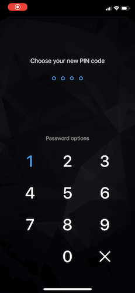

# Measuring PIN and password strength

<!-- AUTHOR realKober 2020-05-18T00:00:00Z -->

_*on Android and iOS with Wultra Passphrase Meter_

Password strength testers did become a common part of the modern application as defenders against attacks via social engineering and brute-force password cracking.

This tutorial will show you how to easily add a password and PIN strength meter feature to your Android or iOS app.

> Wultra Passphrase Meter is available as [Open Source project](https://github.com/wultra/passphrase-meter). Part of the repository is an [iOS](https://github.com/wultra/passphrase-meter/blob/develop/docs/Platform-iOS.md#example-project) and [Android](https://github.com/wultra/passphrase-meter/blob/develop/docs/Platform-Android.md#example-project) test application that you can try.

## UX of a passphrase strength check

Imagine, that in your, otherwise very nice and polished application, you'll force users to type the password, which is at least 12 characters long, must contain at least one uppercase character, one digit, and two special symbols for each authentication or authorization attempt. If yes, then cool, you can be pretty sure that your users use strong passwords, but everybody hates that. So, you can expect bad ratings at the official stores or people do not use your application at all.

Before you use this library, you should consider our recommendations and tips:

1. Your application's security should not depend on this library only. For example, if you're storing passwords in plaintext on the device, then a proper password strength validation doesn't solve your security flaws.

2. You should always consider what kind of attacks are feasible against your application. For example:

  - If passphrase protects user's data stored locally on the device, then you should enforce a strong password, as possible. The reason for that is that if an attacker has the mobile device in the possession, then he can perform an offline brute force attack against the data.
  - On the opposite to that, if a password or PIN is used to authenticate against an online service, with a limited number of failed attempts, then you can lower your requirements for a password.

3. Your application should allow the user to set a weak password if he insists on it. It's a good UX practice unless you protect locally stored data.

4. Let the user decide the password complexity he wants to use.

## UI of a PIN strength check

The checking of the PIN strength should happen after the user chose the whole PIN. In case that the PIN is weak, a user should be notified by "disruptive" UI with a choice if he wants to continue with such PIN or chose a different one.



## UI of a password strength check

Password strength checking should be done "on-the-go" after each modification of the password and the result should be served to the user in textual or other graphical formats.


## Integration



iOS integration is done via Cocoapods. Simply add following lines to your podfile `Podfile`:

```rb
pod 'WultraPassphraseMeter'
pod 'WultraPassphraseMeter/Dictionary_en' # for english dictionary
```

_For more detailed instructions on how to install the library follow [the installation guide inside the project documentation](https://github.com/wultra/passphrase-meter/blob/develop/docs/Platform-iOS.md#installation)._



### Testing the password strength


```swift
import WultraPassphraseMeter

// If your app has an additional dependency on english dictionary,  
// then you need to load that dictionary first.
PasswordTester.shared.loadDictionary(.en)
// Test the password
let strength = PasswordTester.shared.testPassword("test")
print(strength)
```



You can evaluate any password. The result of such operation is a strength of the password with the following levels:

- **Very Weak**
- **Weak**
- **Moderate**
- **Good**
- **Strong**

### Testing the PIN strength



```swift
import WultraPassphraseMeter

let passcode = "1456"
let result = PasswordTester.shared.testPin(passcode)
            
// We want different classification for different pin length
// to not eliminate too many pins (to keep good pins around 95%)

if passcode.count <= 4 {
    if result.contains(.frequentlyUsed) || result.contains(.notUnique) {
        print("This pin is WEAK. Use different one.")
    }
} else if passcode.count <= 6 {
    if result.contains(.frequentlyUsed) || result.contains(.notUnique) || result.contains(.repeatingCharacters) {
        print("This pin is WEAK. Use different one.")
    } 
} else {
    if result.contains(.frequentlyUsed) || result.contains(.notUnique) || result.contains(.repeatingCharacters) || result.contains(.patternFound) {
        print("This pin is WEAK. Use different one.")
    }
}
```



You can evaluate any PIN. The result of the testing is a collection of issues that were found in PIN. This issues can be:

- **Not Unique** - the passcode doesn't have enough unique digits.
- **Repeating Digits** - there is a significant amount of repeating digits in the passcode.
- **Has Pattern** - repeating pattern was found in the passcode - 1357 for example.
- **Possibly Date** - this passcode can be a date and possibly the birthday of the user.
- **Frequently Used** - the passcode is in the list of most used passcodes.
- **Wrong Input** - wrong input - the passcode must contain digits only.

#### Asynchonous usage

Strength checking might be heavy on the CPU in some cases. For this, it is recommended to avoid calling `testPassword` and `testPin` on the main thread.



```swift
import WultraPassphraseMeter

private var queue: OperationQueue =  {
   let q = OperationQueue()
    q.name = "PassMeterQueue"
    q.maxConcurrentOperationCount = 1
    return q
}()
.
.
.
func processPassword(_ password	: String) {
    // if user types too fast, cancel waiting operations and add new one
    queue.cancelAllOperations()
    queue.addOperation {
        let result = PasswordTester.shared.testPassword(password)
        print(result)
    }
}
```



## Summary

Adding a password or PIN strength feature to your mobile application with Wultra Passphrase Meter is fast, easy, and free. You can improve your user security and UX with no more than a few lines of code.