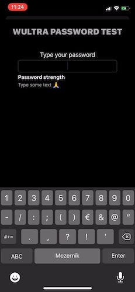

# Measuring PIN and Password Strength

<!-- AUTHOR realKober 2020-05-18T00:00:00Z -->
<!-- SIDEBAR _Sidebar.md sticky -->

Selecting a weak PIN code or an easy-to-guess password is one of the most common issues of modern mobile authentication. According to the [research by DataGenetics](https://www.datagenetics.com/blog/september32012/), over 10% of users simply chose "1234" as a PIN code in the case the system allows it.  

To tackle this issue, the password strength testers became a common part of the modern application. This tutorial will show you how to easily add a password and PIN strength meter feature to your Android or iOS app.

Wultra Passphrase Meter is available as an [open-source project](https://github.com/wultra/passphrase-meter#docucheck-keep-link). Part of the repository is an [iOS](https://github.com/wultra/passphrase-meter/blob/develop/docs/Platform-iOS.md#example-project#docucheck-keep-link) and [Android](https://github.com/wultra/passphrase-meter/blob/develop/docs/Platform-Android.md#example-project#docucheck-keep-link) demo app that you can try.

## UX Perspective

Imagine that in your otherwise a very nice and polished application, you will force the users to type a complex password: at least 12 characters long, must contain at least one uppercase character, one digit, and two special symbols for each authentication or authorization attempt. This way, you can be sure that your users will use strong passwords. However, you can also expect bad ratings at the official stores or people not using your application at all.

Striking the right balance between security and the password type (PIN vs. password) and password complexity (4 vs. 6 digit long PIN, password length) is important. You should always spend some time thinking about this issue.

## User Interface

### PIN Strength Check

You should check the PIN code strength after a user choses the whole PIN code value. In case that the selected PIN code is weak, a user should be notified by a "disruptive" UI and offered a choice to either continue with a weak PIN code, or to select a different one.


### Password Strength Check

Password strength checking should be done "on-the-go", after each modification of the password and the evaluation result should be presented to the user in a textual or other graphical format.



## Getting the SDK




To get Wultra Passphrase Meter for Android up and running in your app, add following dependency in your `gradle.build` file:

```groovy
repositories {
    jcenter() // if not defined elsewhere...
}

dependencies {
    implementation "com.wultra.android.passphrasemeter:passphrasemeter-core:1.0.0"
    implementation "com.wultra.android.passphrasemeter:passphrasemeter-dictionary-en:1.0.0" // For english speaking people
}
```



iOS integration is done via Cocoapods. Simply add the following lines to your `Podfile`:

```rb
pod 'WultraPassphraseMeter'
pod 'WultraPassphraseMeter/Dictionary_en' # for english dictionary
```

_Note: For more detailed instructions on how to install the library, follow [the installation guide in the project documentation](https://github.com/wultra/passphrase-meter/blob/develop/docs/Platform-iOS.md#installation)._



## Testing Passwords

In order to test the password strength, use the following code:



```kotlin
import com.wultra.android.passphrasemeter.*
import com.wultra.android.passphrasemeter.exceptions.*

// If your app has an additional dependency on english dictionary,  
// then you need to load that dictionary first.
// assets is property of ContextThemeWrapper
try {
	PasswordTester.getInstance().loadDictionary(assets, "en.dct")
	// Test the password
	val result = PasswordTester.getInstance().testPassword("test")
	print("Strength", result.name)
} catch (e: WrongPasswordException) {
	// Password check failed
}
```


```swift
import WultraPassphraseMeter

// If your app has an additional dependency on english dictionary,  
// then you need to load that dictionary first.
PasswordTester.shared.loadDictionary(.en)
// Test the password
let strength = PasswordTester.shared.testPassword("test")
print(strength)
```



You can evaluate any password. The result of such operation is a strength of the password with the following levels:

- **Very Weak**
- **Weak**
- **Moderate**
- **Good**
- **Strong**

## Testing PIN Codes

The PIN code testing is slightly different from the password testing. The result of a PIN code strength test is a list of findings, that you can use to evaluate the PIN code strength, rather than a strength itself.

Here is an example code of such evaluation:



```kotlin
import com.wultra.android.passphrasemeter.*
import com.wultra.android.passphrasemeter.exceptions.*

try {
    val passcode = "1456"
    val result = PasswordTester.getInstance().testPin(passcode)
    var isWeak = false

    if (passcode.length <= 4) {
        isWeak = result.contains(PinTestResult.FREQUENTLY_USED) || result.contains(PinTestResult.NOT_UNIQUE)
    } else if (passcode.length <= 6) {
        isWeak = result.contains(PinTestResult.FREQUENTLY_USED) || result.contains(PinTestResult.NOT_UNIQUE) || result.contains(PinTestResult.REPEATING_CHARACTERS)
    } else {
        isWeak = result.contains(PinTestResult.FREQUENTLY_USED) || result.contains(PinTestResult.NOT_UNIQUE) || result.contains(PinTestResult.REPEATING_CHARACTERS) || result.contains(PinTestResult.HAS_PATTERN)
    }

    if (isWeak) {
        print("This PIN is WEAK. Use different one.")
    } else {
        print("PIN OK")
    }
} catch (e: WrongPinException) {
    // PIN format error
}
```


```swift
import WultraPassphraseMeter

let passcode = "1456"
let result = PasswordTester.shared.testPin(passcode)
var isWeak = false

if passcode.count <= 4 {
    isWeak = result.contains(.frequentlyUsed) || result.contains(.notUnique)
} else if passcode.count <= 6 {
    isWeak = result.contains(.frequentlyUsed) || result.contains(.notUnique) || result.contains(.repeatingCharacters)
} else {
    isWeak = result.contains(.frequentlyUsed) || result.contains(.notUnique) || result.contains(.repeatingCharacters) || result.contains(.patternFound)
}

if isWeak {
    print("This PIN is WEAK. Use different one.")
} else {
    print("PIN OK")
}
```



You can evaluate any PIN. The result of the testing is a collection of issues that were found in PIN. This issues can be:

- **Not Unique** - The passcode doesn't have enough unique digits.
- **Repeating Digits** - There is a significant amount of repeating digits in the passcode.
- **Has Pattern** - Well-known pattern was found in the passcode - 1357 for example.
- **Possibly Date** - This passcode can be a date, such as the birthday of the user.
- **Frequently Used** - The passcode is in the list of the most frequently used passcodes.
- **Wrong Input** - Wrong input - the passcode must contain digits only.

## Asynchronous Usage

Password and PIN strength checking might be heavy on the CPU in some cases. To avoid any UI shuttering, we recommend to avoid calling `testPassword` and `testPin` on the main thread.



```kotlin
import android.support.annotation.WorkerThread

@WorkerThread
private fun processPassword(password: String) {
	// ...
}
```


```swift
import WultraPassphraseMeter

private var queue: OperationQueue =  {
   let q = OperationQueue()
    q.name = "PassMeterQueue"
    q.maxConcurrentOperationCount = 1
    return q
}()

// ...

func processPassword(_ password : String) {
    // if the user types too fast, cancel waiting operations and add new one
    queue.cancelAllOperations()
    queue.addOperation {
        let result = PasswordTester.shared.testPassword(password)
        print(result)
    }
}
```



## Summary

Adding a password or a PIN code strength check to your mobile app is fast, easy, and *free!* with the Wultra Passphrase Meter. You can improve your app security and UX with no more than a few lines of code, and we encourage you to give our library a try.
