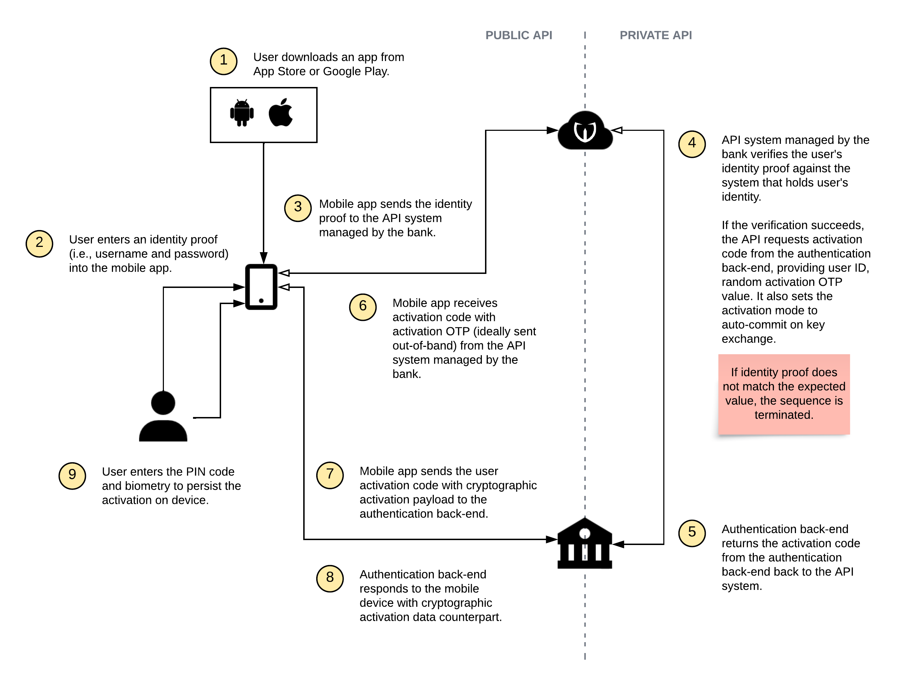
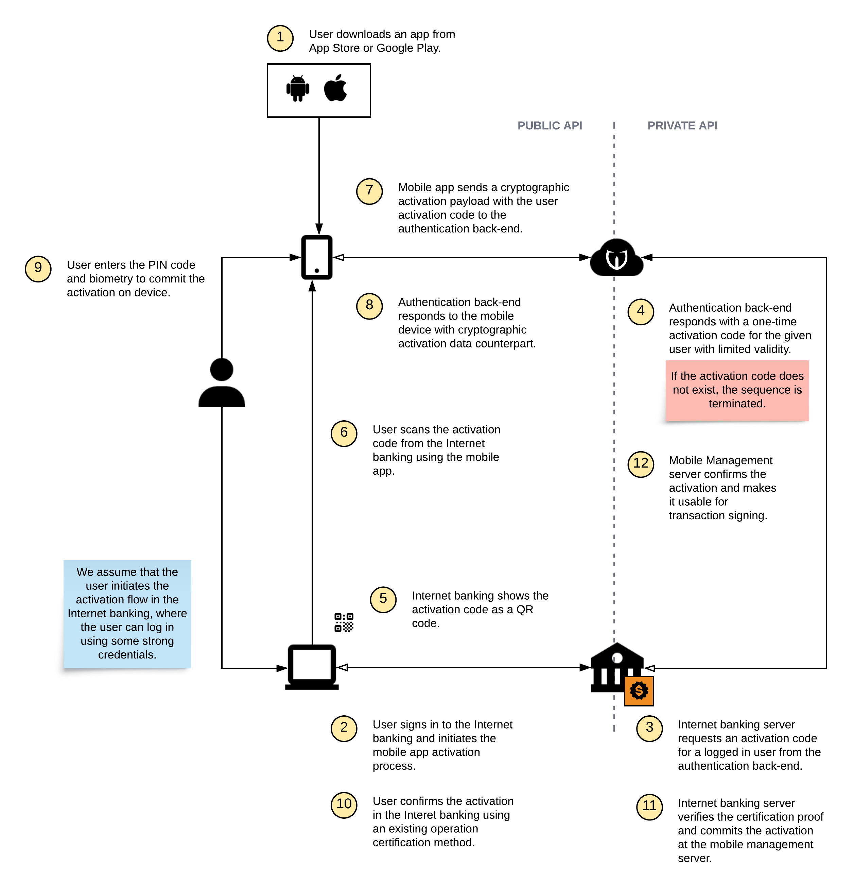
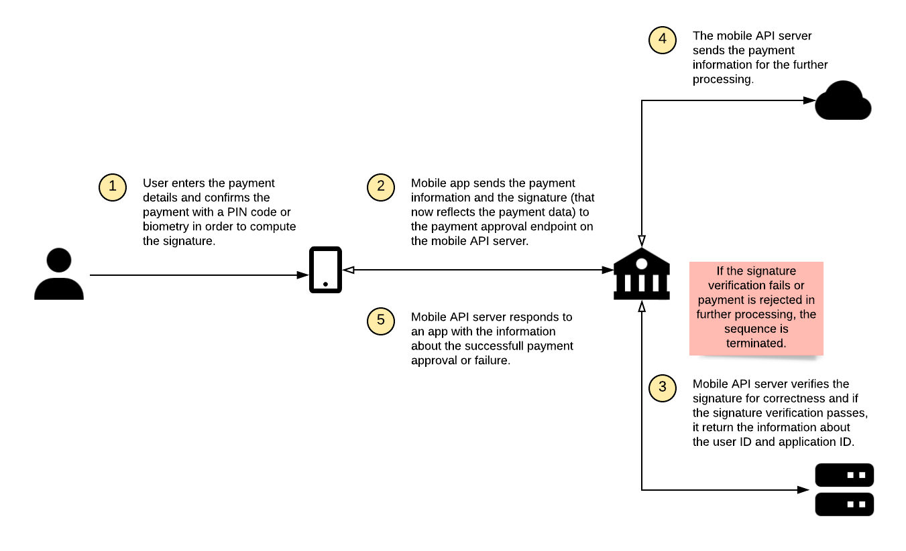

# Mobile-First Authentication in Banking (SCA)

<!-- AUTHOR joshis_tweets 2023-12-29T00:00:00Z -->
<!-- SIDEBAR _Sidebar.md sticky -->
<!-- TEMPLATE tutorial -->
<!-- COVER_IMAGE cover.jpg -->

In this tutorial, we will show you how to implement mobile-first authentication into your banking or fintech apps.

This tutorial has five parts:

- **Problem Overview**
- [Installing Server-Side Components](Server-Side-Tutorial-Deployment.md)
- [Integrating with Your Back-End Applications](Server-Side-Tutorial-Integration.md)
- [Implementing Mobile-First Authentication on iOS](iOS-Tutorial.md)
- [Implementing Mobile-First Authentication on Android](Android-Tutorial.md)

## Problem Overview

Authentication is a process of verifying the user's identity. It is usually performed to manage access to an application (login) or in order to approve a transaction, such as payment, using a reliable user identity proof. In case of the banking systems, managing access to systems and transaction signing are two critical requirements from both security and compliance perspective.

In the terms of the security, a well-designed authentication and operation approval system improves the confidentiality of the financial information, since only the correct users can access the particular account information. At the same time, it prevents money loss by protecting the financial transactions from being manipulated, since each payment has a strong cryptographic proof (such that cannot be forged, replayed, or connected to other transaction) of the user who approved it.

In the terms of the compliance, these mechanisms are required for example to comply with the European PSD3 legislation and its requirements on Strong Customer Authentication (SCA).

Last but not least, correctly designed cryptographic protocol for authentication usually improves the user experience, since the users can login or approve a payment with a simple PIN code instead of a long password, or with a biometric authentication.

[Mobile-First Authentication](https://www.wultra.com/products/mobile-first-authentication) is a solution (plugin or a white-label app) for iOS and Android that - together with its server counterparts - covers the authentication and transaction signing functionality, allowing the end-users to login or approve payments using PIN code or biometry. It also covers all related use-cases, such as authentication element lifecycle (active, blocked, removed), PIN code change, biometry settings, etc. It uses [an open-source cryptographic PowerAuth protocol](/components/powerauth-crypto) that is trusted by leading banks and financial institutions to back the authentication-related processes with strong cryptography.

## Registration

When a user downloads a mobile app for iOS or Android, this app is always a blank, non-personalized app. Basically, it is the same app for all users who download it. In order to connect the app with the user account, the user needs to "activate" the application first. This requires an interplay between the mobile app and server components, as well as a user providing credentials as an identity proof that could be used to identify the user reliably. We call this initial process **Registration**. Sometimes, it is also referred to as activation, enrollment, or personalization, and these terms can be used interchangeably with confidence.

The registration can be either performed fully on the mobile device (it is both initiated and completed on the mobile device), or in an "out-of-band" mode (initiated externally, for example, in the Internet banking, and completed both on the mobile device and in the external systems that initiated the activation).

While the back-end system supports using flexible methods of registration using custom credentials (verified against a provided service), we recommend designing the registration flow so that is always uses an **Activation Code**. Activation code is a temporary one-time credential issued by our system whenever your systems ask for it and assigned to a user ID for whom the registration should be carried out.

### On-Device Registration

The high-level overview of the on-device registration steps is captured in this diagram:

As you can see, this diagram is relatively simple and straight-forward.

The first thing the mobile app has to do is to authenticate the user with some existing means of verification. It can be standard credentials, such as the username and password, or it can be an identity proofing step (scanning personal ID, server-side facial biometrics, etc.) Based on the verification, authentication back-end issues a user-specific activation code to the mobile app (while setting auto-commit mode), and the mobile app can then enrol using the activation code.

### Out-of-Band Activation

The high-level overview of the out-of-band activation steps is captured in this diagram:

While this diagram seems a bit more complex, the process is still very simple. The main difference is in the initiation of the process, where some external system, in our case the Internet banking, must fetch and display the activation code (usually represented by a QR code, link with the parameter, or a text value). Later in the process, the Internet banking must also confirm the activation in order to make it useable on the just activated device.

## Transaction Signing

After the user activates the mobile app, it is ready for its main use case: **Transaction signing**.

The transaction signing is technically used for all types of operations - login, payments, configuration changes, etc. In all cases, the user needs to enter a PIN code set during the activation, or use biometrics on the mobile device to compute an authentication code for the data. The authentication code is later verified on the server-side.

In the case of the login, the authentication code is computed only from the authentication factor keys. In the case of the payment (or other similar operation that generally has some data assigned to it), both authentication factor keys and operation data is reflected in the resulting authentication code.

<!-- begin box info -->
The PSD3 legislation uses the term "dynamic linking" for this dependency of the authentication code on the operation data. PSD3 mandates using at least the other party account number, own account number and a payment amount as data that enters the authentication code, and the use of at least two authentication factors.
<!-- end -->

The number of authentication attempts is limited. If the authentication code verification fails, the number of remaining accounts is decremented. If there are no more attempts left, the registration is blocked.

### Login

The overview diagram of the transaction signing for login is captured below:

### Payment approval

The overview diagram of the transaction signing for payment approval is not much different from the login diagram:

The main difference is that after a successful authentication code verification, the payment is sent for the further processing after being approved by given user. The invisible difference is that the authentication code is computed using the payment data.

## Other Use-Cases

Of course, every authentication and transaction signing system also implements some typical auxiliary use-cases, such as:

- Activation status check.
- Activation blocking and removal.
- Password / PIN code change.
- Biometric authentication setup.
- End-to-end payload encryption.

Please refer to the detailed documentation for more information about those.

## Continue Reading

You can proceed with one of the following chapters:

- [Problem Overview](Readme.md)
- [Installing Server-Side Components](Server-Side-Tutorial-Deployment.md)
- [Integrating with Your Back-End Applications](Server-Side-Tutorial-Integration.md)
- [Implementing Mobile-First Authentication on iOS](iOS-Tutorial.md)
- [Implementing Mobile-First Authentication on Android](Android-Tutorial.md)

## Resources

You can find more details in our reference documentation:

- [Cryptography Specification](/components/powerauth-crypto)
- [PowerAuth Cloud](/components/powerauth-cloud)
- [Mobile Authentication SDK for iOS and Android](/components/powerauth-mobile-sdk)
- [Mobile Token SDK for iOS](/components/mtoken-sdk-ios)
- [Mobile Token SDK for Android](/components/mtoken-sdk-android)
