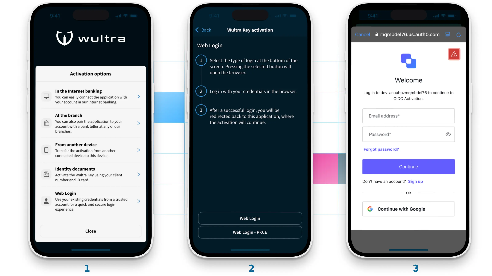

# OIDC Based Activation

<!-- AUTHOR marekstransky 2024-12-16T00:00:00Z -->
<!-- SIDEBAR _Sidebar.md sticky -->
<!-- TEMPLATE tutorial -->
<!-- COVER_IMAGE ThirdParty_OIDC_Login.webp -->

OpenID Connect ([OIDC](https://openid.net/developers/how-connect-works/)) has become a leading interoperable authentication protocol built on [OAuth 2.0](https://oauth.net/2/), the industry-standard protocol for authorization.
OIDC offers tangible benefits for banks, fintech companies, and users alike — to highlight its potential to transform secure identity identification, let’s explore how OIDC works and how our solution is expanding its real-world applications.

## Introduction

OIDC enables third-party applications to verify an end user’s identity and gather basic profile information through trusted third-party providers.
You’ve likely encountered this protocol when logging into one of many services that use Google, LinkedIn, or Facebook accounts.

While social accounts and emails are common in general verification, these methods aren’t robust enough for businesses in the financial sector that require top-tier security.
It’s for this reason that banks and fintech companies turn to more secure methods — like digital bank IDs — that prove a user’s identity while also ensuring full compliance with regulatory standards.

For example, banking customers in the Czech Republic can now verify their identity via OIDC using [Bank iD](https://bankid.cz/).
Similar capabilities extend across Europe, as a growing number of national bank IDs support OIDC, including Finland’s Bank ID (part of the [Finnish Trust Network](https://www.signicat.com/use-cases/finnish-trust-network)), Belgium’s [itsme®](https://www.itsme-id.com/en-BE), Norway’s [BankID](https://bankid.no/en), Denmark’s [MitID](https://www.mitid.dk/en-gb/), and the Netherlands' [eHerkenning](https://www.eherkenning.nl/en), among others.

## Mobile Token

We offer several methods for activating our standalone mobile token app.
Now our mobile token incorporates OIDC feature via standardized API.
This additional functionality allows users to verify their identity through third-party methods (Web Login).
Activating our mobile token via Web Login is simple.

It’s important to note that this is an example of the process, as the instructions will differ based on a user’s digital bank ID.

## Real-World Examples of OIDC in Action

There are a number of important use cases in which Wultra’s OIDC-based authentication can be put to use:

- **Forgotten credentials:** If a user forgets their password or login details, they can use OIDC (through a verified third-party account) to regain access.
- **New device activation:** When a user gets a new phone, they can seamlessly transfer the mobile token, which prevents any disruptions to their access.
- **Digital bank IDs:** As mentioned above, our integration enables users to verify themselves via the array of European digital bank IDs that support OIDC.

## Benefits of Using OIDC

In a nutshell, OIDC enhances user experience, supports broad compatibility for easy scalability, and enables banks to meet compliance standards through eKYC.

- **Positive user experience:** The ability to log in with a familiar third-party service makes accessing one’s accounts quicker and easier, reducing login fatigue and enhancing user satisfaction. Minimizing steps results in faster registration, fewer abandoned accounts, and increased engagement.‍
- **Standardization and interoperability:** OIDC is an open standard, which makes it both widely compatible with various platforms and services and easy to implement. Banks and fintech companies can easily scale and adapt authentication systems during various stages of growth.‍
- **Identity assurance support (eKYC):** Through OIDC, banks can implement electronic Know Your Customer (eKYC) processes. This ensures regulatory compliance and aligns with industry standards for identity assurance.

## SDK

TODO marek

## Backend

TODO Lubos

## Summary

In this tutorial we have shown how to use the OIDC protocol together with mobile token, which leverage activation that’s both secure and user-friendly.
